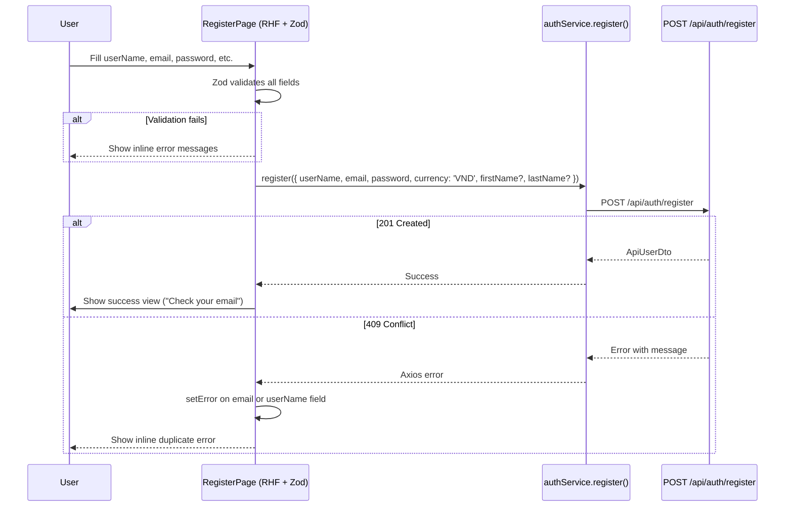

# 01 - Registration (Frontend)

## Status: Implemented

---

## API Call

| Property | Value |
|----------|-------|
| Function | `register()` |
| Service | `authService.ts` |
| Method | `POST` |
| Endpoint | `/api/auth/register` |
| Auth | Anonymous |
| Request Type | `RegisterRequest` |
| Response Type | `ApiUserDto` |
| Success HTTP | `201 Created` |

---

## Request Schema

```typescript
interface RegisterRequest {
  userName: string;
  email: string;
  password: string;
  currency: string;       // Hardcoded to 'VND' in RegisterPage
  firstName?: string;
  lastName?: string;
}
```

### FE Validation (Zod)

| Field | Rule | i18n Error Key |
|-------|------|---------------|
| `userName` | `min(1)` | `auth.userNameRequired` |
| `firstName` | Optional | — |
| `lastName` | Optional | — |
| `email` | `min(1)`, `.email()` | `auth.emailRequired`, `auth.emailInvalid` |
| `password` | `min(8)` | `auth.passwordMinLength` |
| `confirmPassword` | `min(1)`, must equal `password` | `auth.passwordRequired`, `auth.passwordMismatch` |

Note: `confirmPassword` is FE-only validation. The `currency` field is not in the form -- it is hardcoded to `'VND'` in the submit handler.

---

## Response Handling

### Success (201)
1. Set local state `registered = true`
2. Render success view with:
   - `Alert` with `auth.registerSuccess` message
   - Link to `/login`
3. **No auto-login** — user must confirm email first, then log in separately

### Error Handling

| HTTP Status | Detection | Action |
|------------|-----------|--------|
| 409 | `axios.isAxiosError` + `status === 409` | Parse `message` to determine which field is duplicate |
| 409 (email) | `message.includes('email')` | `setError('email', { message: 'auth.emailTaken' })` |
| 409 (username) | `message.includes('username')` or `message.includes('user')` | `setError('userName', { message: 'auth.userNameTaken' })` |
| Other | Any other error | `setError('root', { message: 'common.error' })` |

---

## FE Flow



---

## Component Tree

```
RegisterPage
├── Form (Ant Design, layout="vertical")
│   ├── Section: Personal Info
│   │   ├── Controller → Input (userName)
│   │   ├── Controller → Input (firstName)
│   │   └── Controller → Input (lastName)
│   ├── Section: Account Info
│   │   ├── Controller → Input (email)
│   │   ├── Controller → Input.Password (password)
│   │   └── Controller → Input.Password (confirmPassword)
│   ├── Terms text with links to /terms and /privacy
│   └── Button (submit, loading state)
├── Footer
│   ├── Link to /login ("Already have an account?")
│   └── Feature badges (SECURE PAY, NFT VERIFIED, 24/7 SUPPORT)
└── Success View (conditional, after registered = true)
    ├── Alert (success message)
    └── Link to /login
```

---

## i18n Keys Used

| Key | English Value |
|-----|---------------|
| `auth.registerTitle` | Create Account |
| `auth.registerSubtitle` | Create a free account to start bidding. |
| `auth.userName` | Username |
| `auth.firstName` | First name |
| `auth.lastName` | Last name |
| `auth.email` | Email |
| `auth.password` | Password |
| `auth.confirmPassword` | Confirm Password |
| `auth.userNameRequired` | Please enter a username |
| `auth.emailRequired` | Please enter your email |
| `auth.emailInvalid` | Invalid email address |
| `auth.passwordMinLength` | Password must be at least {{min}} characters |
| `auth.passwordRequired` | Please enter your password |
| `auth.passwordMismatch` | Passwords do not match |
| `auth.registerButton` | Register |
| `auth.registerSuccess` | Registration successful! Please check your email... |
| `auth.emailTaken` | This email is already in use. |
| `auth.userNameTaken` | This username is already taken. |
| `auth.alreadyHaveAccount` | Already have an account? |
| `auth.loginButton` | Login |
| `auth.terms` | Terms |
| `auth.privacy` | Privacy |
| `auth.personalInfo` | (defaultValue: Thong tin ca nhan) |
| `auth.accountInfo` | (defaultValue: Thong tin tai khoan) |
| `auth.registerTerms` | (defaultValue: By registering, you agree...) |
| `auth.registerBadge` | (defaultValue: Dang ky tai khoan moi) |
| `auth.registerHeroTitle` | Create. Sell. Collect. |
| `auth.registerHeroSubtitle` | Build your brand... |

---

## Source Files

| Layer | File |
|-------|------|
| Page | `pages/public/RegisterPage.tsx` |
| Style | `pages/public/RegisterPage.scss` |
| Service | `services/authService.ts` (`register()`) |
| Types | `types/index.ts` (`RegisterRequest`, `ApiUserDto`) |
| i18n | `locales/en/common.json` (`auth.*`) |
| i18n | `locales/vi/common.json` (`auth.*`) |
