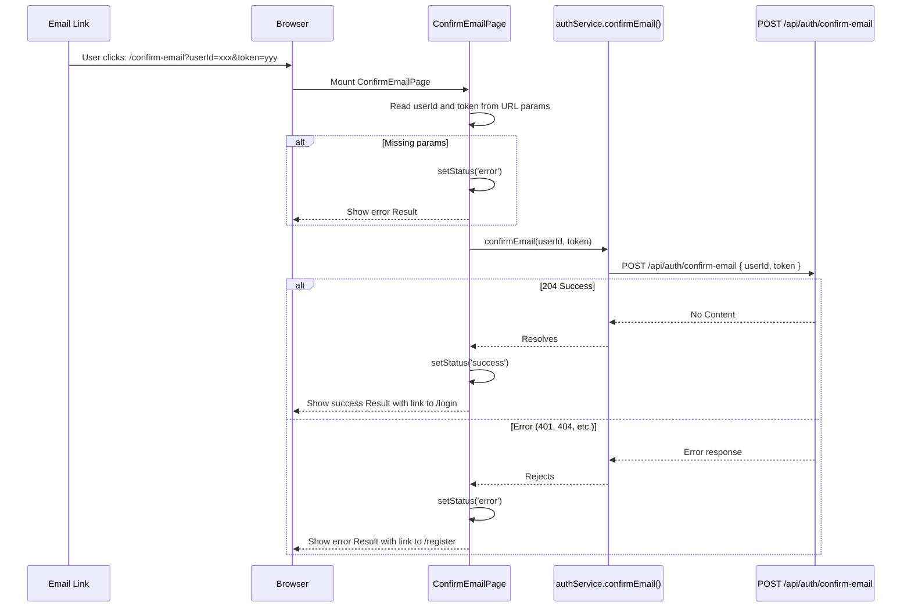

# 02 - Email Verification (Frontend)

## Status: Implemented

---

## API Call

| Property | Value |
|----------|-------|
| Function | `confirmEmail()` |
| Service | `authService.ts` |
| Method | `POST` |
| Endpoint | `/api/auth/confirm-email` |
| Auth | Anonymous |
| Request Body | `{ userId: string, token: string }` |
| Success HTTP | `204 No Content` |

---

## Request Schema

```typescript
// Extracted from URL search params, not from a form
{
  userId: string;   // from ?userId=...
  token: string;    // from ?token=...
}
```

No Zod validation -- the page reads `userId` and `token` directly from `useSearchParams()`. If either is missing, the page immediately shows an error state.

---

## FE Flow



---

## Component Tree

```
ConfirmEmailPage
├── Loading state
│   └── Spin (centered, size="large")
├── Success state
│   └── Card (max-width 420px)
│       └── Result
│           ├── icon: CheckCircleOutlined (green)
│           ├── title: t('auth.confirmEmailTitle')
│           ├── subTitle: t('auth.confirmEmailSuccess')
│           └── extra: Button → Link to /login
└── Error state
    └── Card (max-width 420px)
        └── Result
            ├── icon: CloseCircleOutlined (red)
            ├── title: t('auth.confirmEmailTitle')
            ├── subTitle: t('auth.confirmEmailFailed')
            └── extra: Button → Link to /register
```

---

## State Management

The page uses local `useState<'loading' | 'success' | 'error'>`. No Redux or TanStack Query involvement -- this is a one-shot operation that does not need caching or global state.

The `useEffect` fires once on mount (deps: `[userId, token]`) and calls the API.

---

## Error Handling

| Scenario | Behavior |
|----------|----------|
| Missing `userId` or `token` in URL | Immediately shows error state (no API call) |
| API returns 401 (invalid/expired token) | Shows error state |
| API returns 404 (user not found) | Shows error state |
| Network error | Shows error state |
| API returns 204 (success) | Shows success state with login link |

The page does not distinguish between error types -- any rejection shows the same error UI. The error message says "The link may have expired" via `auth.confirmEmailFailed`.

---

## i18n Keys Used

| Key | English Value |
|-----|---------------|
| `auth.confirmEmailTitle` | Confirm Email |
| `auth.confirmEmailSuccess` | Email confirmed. You can now log in. |
| `auth.confirmEmailFailed` | Email confirmation failed. The link may have expired. |
| `auth.loginButton` | Login |
| `auth.registerButton` | Register |

---

## Not Implemented

| Feature | BE Endpoint | Notes |
|---------|-------------|-------|
| Resend confirmation email | `POST /api/auth/resend-confirm-email` | No button or UI on ConfirmEmailPage to resend |

---

## Source Files

| Layer | File |
|-------|------|
| Page | `pages/public/ConfirmEmailPage.tsx` |
| Service | `services/authService.ts` (`confirmEmail()`) |
| Route | `routes/index.tsx` (path: `/confirm-email`) |
| i18n | `locales/en/common.json` (`auth.confirmEmail*`) |
