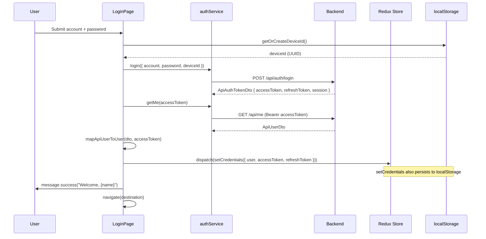

# 03 - Login (Frontend)

## Status: Implemented

---

## API Calls

| Step | Function | Method | Endpoint | Purpose |
|------|----------|--------|----------|---------|
| 1 | `login()` | POST | `/api/auth/login` | Authenticate and receive tokens |
| 2 | `getMe()` | GET | `/api/me` | Fetch user profile with fresh token |

Both are in `authService.ts`.

---

## Request Schema

```typescript
interface LoginRequest {
  account: string;     // Email or username
  password: string;
  deviceId: string;    // UUID from localStorage
}
```

### FE Validation (Zod)

| Field | Rule | i18n Error Key |
|-------|------|---------------|
| `account` | `min(1)` | `auth.accountRequired` |
| `password` | `min(1)` | `auth.passwordRequired` |

Note: `deviceId` is not in the form. It is retrieved via `getOrCreateDeviceId()` at submit time.

---

## Response Handling

### Success Flow (3 steps)



### Post-login Redirect Logic

```typescript
// Priority order:
// 1. Intended path (from ProtectedRoute redirect state)
const intendedPath = location.state?.from?.pathname;

// 2. Role-based default route
const getRoleDefaultRoute = (roles) => {
  if (roles.includes('admin') || roles.includes('super_admin')) return '/admin';
  if (roles.includes('moderator'))    return '/moderator';
  if (roles.includes('risk_manager')) return '/risk';
  if (roles.includes('support'))      return '/support';
  if (roles.includes('marketing'))    return '/marketing';
  return '/dashboard';  // 3. Fallback
};
```

### Error Handling

| HTTP Status | Action | i18n Key |
|------------|--------|----------|
| 401 | Show "Invalid email or password" | `auth.invalidCredentials` |
| 403 | Show "Email not confirmed" | `auth.emailNotConfirmed` |
| Other | Show generic error | `common.error` |

---

## Device ID Tracking

The `getOrCreateDeviceId()` function in `authService.ts` generates a persistent browser identifier:

1. Check `localStorage.getItem('deviceId')`
2. If found, return it
3. If not, generate a UUID v4-like string using `Math.random()`
4. Store in `localStorage.setItem('deviceId', newId)`
5. Return the new ID

This ID is sent with login, refresh, and logout requests. The backend uses it to:
- Bind sessions to devices
- Detect device mismatches during token rotation
- Support per-device session revocation

---

## JWT Role Parsing

After login, `parseRolesFromToken(accessToken)` extracts roles from the JWT payload without verification:

1. Split token by `.`, take the middle part (payload)
2. Base64url decode to JSON
3. Read `roles` or `role` claim
4. Validate against known `UserRole` values
5. Fallback to `['bidder']` if parsing fails

**Known valid roles:** `user`, `guest`, `bidder`, `seller`, `moderator`, `risk_manager`, `support`, `marketing`, `admin`, `super_admin`

---

## Permission Parsing

`parsePermissionsFromToken(token)` extracts fine-grained permissions:

1. Same JWT decode as roles
2. Read `permission` claim (singular)
3. Return as `string[]` (e.g., `["Permissions.Auctions.Create"]`)
4. Fallback to `[]` if not present

---

## User Mapping

`mapApiUserToUser(dto, accessToken)` transforms the backend `ApiUserDto` into the frontend `User` type:

| Frontend Field | Source |
|---------------|--------|
| `id` | `dto.id` |
| `email` | `dto.email` |
| `fullName` | `dto.profile?.fullName` or `firstName + lastName` or `dto.userName` |
| `avatarUrl` | `dto.profile?.avatarUrl ?? null` |
| `roles` | `parseRolesFromToken(accessToken)` |
| `isEmailVerified` | `dto.emailConfirmed` |
| `hasSellerPermission` | `roles.includes('seller')` |
| `createdAt` | `dto.createdAt` |

---

## Redux Dispatch

The `setCredentials` action stores:
- `user` in Redux state + `localStorage('user')`
- `accessToken` in Redux state + `localStorage('accessToken')`
- `refreshToken` in `localStorage('refreshToken')` only (not in Redux state)

---

## Component Tree

```
LoginPage
├── Hero section (left panel)
│   ├── Title (heroTitleLine1, heroTitleLine2)
│   ├── Subtitle (heroSubtitle)
│   └── Stats (50k+ items, 120+ countries, $2.4B volume)
├── Login panel (right panel)
│   ├── Brand (oio.vn logo)
│   ├── Intro (loginTitle, loginSubtitle)
│   ├── Form (Ant Design + RHF + Zod)
│   │   ├── Controller → Input (account, with MailOutlined prefix)
│   │   ├── Controller → Input.Password (password, with LockOutlined prefix)
│   │   ├── Actions row
│   │   │   ├── Checkbox (Remember me)
│   │   │   └── Link to /forgot-password
│   │   └── Button (submit, loading state)
│   ├── Social buttons (Google, GitHub — not functional)
│   ├── Register link → /register
│   └── Footer (Terms, Privacy, Support links)
```

---

## Not Implemented

| Feature | Notes |
|---------|-------|
| 2FA login verification | When backend returns `requiresTwoFactor: true`, the FE does not handle it. No TOTP code entry UI exists in LoginPage. |
| Remember me | Checkbox renders but has no logic (no persistent session behavior difference). |
| Social login (Google, GitHub) | Buttons render but `onClick` is empty. |

---

## i18n Keys Used

| Key | English Value |
|-----|---------------|
| `auth.loginTitle` | Login |
| `auth.loginSubtitle` | Sign in to your auction account |
| `auth.email` | Email |
| `auth.password` | Password |
| `auth.loginButton` | Login |
| `auth.forgotPassword` | Forgot password? |
| `auth.rememberMe` | Remember me |
| `auth.noAccount` | Don't have an account? |
| `auth.registerButton` | Register |
| `auth.invalidCredentials` | Invalid email or password. |
| `auth.emailNotConfirmed` | Email not confirmed. Please check your inbox. |
| `auth.terms` | Terms |
| `auth.privacy` | Privacy |
| `auth.heroTitleLine1` | (defaultValue: Trai nghiem) |
| `auth.heroTitleLine2` | (defaultValue: Dau gia The he moi) |
| `auth.heroSubtitle` | (defaultValue: Kham pha cac bo suu tap...) |
| `auth.orLoginWith` | Or log in with |
| `dashboard.welcome` | (with name interpolation) |
| `common.error` | An error occurred... |
| `common.support` | Support |
| `common.menu` | Menu |

---

## Source Files

| Layer | File |
|-------|------|
| Page | `pages/public/LoginPage.tsx` |
| Style | `pages/public/LoginPage.scss` |
| Service | `services/authService.ts` (`login()`, `getMe()`, `mapApiUserToUser()`, `getOrCreateDeviceId()`, `parseRolesFromToken()`) |
| State | `features/auth/authSlice.ts` (`setCredentials`) |
| Types | `types/index.ts` (`LoginRequest`, `ApiAuthTokenDto`, `ApiUserDto`, `User`) |
| Route | `routes/index.tsx` (path: `/login`) |
