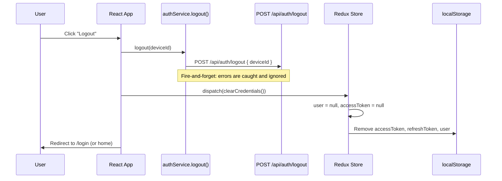

# 06 - Logout (Frontend)

## Status: Implemented

---

## API Call

| Property | Value |
|----------|-------|
| Function | `logout()` |
| Service | `authService.ts` |
| Method | `POST` |
| Endpoint | `/api/auth/logout` |
| Auth | None (fire-and-forget) |
| Request Body | `{ deviceId: string }` |
| Response | `void` (errors silently caught) |

---

## Logout Flow



---

## Key Behaviors

### Fire-and-Forget API Call

The `logout()` function wraps the API call in a try-catch that swallows all errors:

```typescript
export async function logout(deviceId: string): Promise<void> {
  try {
    await authAxios.post('/api/auth/logout', { deviceId });
  } catch {
    // Intentionally ignore errors — local cleanup happens regardless
  }
}
```

This design ensures local state is always cleaned up, even if:
- The network is down
- The token has already expired
- The server is unreachable

### Backend Behavior

When `deviceId` is provided and matches the JWT's `deviceId`:
- Backend revokes only the session for that specific device (**Path 1: Specific Device Logout**)
- Adds device to the revocation blacklist cache

When `deviceId` is missing or mismatches:
- Backend revokes ALL sessions for the user (**Path 2: All Sessions Logout**)

The FE always sends `deviceId` from `getOrCreateDeviceId()`, so the normal case is Path 1 (single device logout).

### Local State Cleanup

The `clearCredentials()` Redux action performs:

1. Set `state.user = null`
2. Set `state.accessToken = null`
3. Remove `localStorage.accessToken`
4. Remove `localStorage.refreshToken`
5. Remove `localStorage.user`

Note: `localStorage.deviceId` is **not** removed during logout. The device ID persists across login/logout cycles -- it identifies the browser, not the session.

---

## Implicit Logout (Refresh Failure)

Logout also happens implicitly when the 401 interceptor's refresh attempt fails:

```typescript
// In api.ts response interceptor
} catch (refreshError) {
  processQueue(refreshError, null);
  store.dispatch(clearCredentials());
  window.location.href = '/login';
  return Promise.reject(refreshError);
}
```

In this case, there is no API call to `/api/auth/logout` -- the local state is simply cleared.

---

## Source Files

| Layer | File |
|-------|------|
| Service | `services/authService.ts` (`logout()`) |
| State | `features/auth/authSlice.ts` (`clearCredentials`) |
| Interceptor | `services/api.ts` (implicit logout on refresh failure) |
| Types | `types/index.ts` (no specific logout types needed) |
