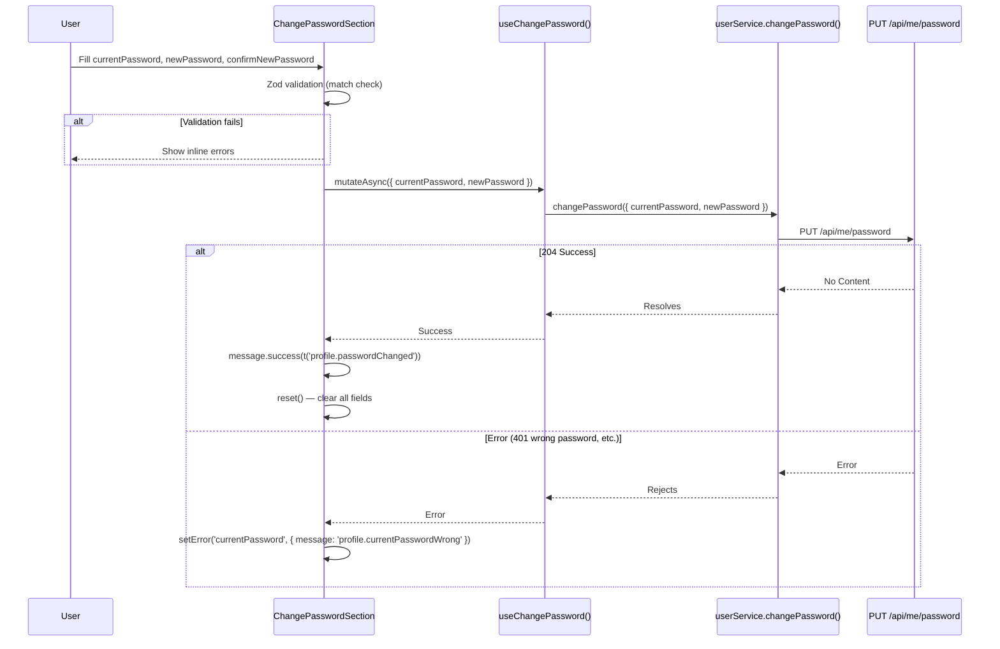

# 09 - Change Password (Frontend)

## Status: Implemented

---

## API Call

| Property | Value |
|----------|-------|
| Function | `changePassword()` |
| Service | `userService.ts` |
| Method | `PUT` |
| Endpoint | `/api/me/password` |
| Auth | Bearer (required) |
| Request Type | `ChangePasswordRequest` |
| Success HTTP | `204 No Content` |

---

## Request Schema

```typescript
interface ChangePasswordRequest {
  currentPassword: string;
  newPassword: string;
}
```

### FE Validation (Zod)

| Field | Rule | i18n Error Key |
|-------|------|---------------|
| `currentPassword` | `min(1)` | `profile.currentPasswordRequired` |
| `newPassword` | `min(8)` | `auth.passwordMinLength` |
| `confirmNewPassword` | `min(1)`, must equal `newPassword` | `auth.passwordRequired`, `auth.passwordMismatch` |

Note: `confirmNewPassword` is FE-only validation. Only `currentPassword` and `newPassword` are sent to the backend.

---

## FE Flow



---

## Backend Side Effects

When the password change succeeds, the backend:

1. **Revokes ALL sessions** — `user.RevokeAllSession("Password changed")`
2. **Blacklists all JWTs** — `RevokeAllDevicesAsync(userId)` in cache
3. **Sends email alert** — `SendPasswordChangedAlertAsync(email, userName)`

This means the user will be logged out on all other devices. The current session's access token will also be rejected on the next API call, triggering the 401 interceptor. The refresh will fail (session revoked), and the user will be redirected to `/login`.

**Important FE implication:** After a successful password change, the user should expect to be logged out shortly (when their current access token expires or on the next API call).

---

## Component Tree

```
SecurityTab
└── ChangePasswordSection
    ├── Text label (profile.changePassword)
    └── form (native HTML form)
        ├── Form.Item
        │   └── Controller → Input.Password (currentPassword)
        ├── Row (gutter=16)
        │   ├── Col (xs=24, xl=12)
        │   │   └── Form.Item
        │   │       └── Controller → Input.Password (newPassword)
        │   └── Col (xs=24, xl=12)
        │       └── Form.Item
        │           └── Controller → Input.Password (confirmNewPassword)
        └── Button (submit, loading state)
```

### Responsive Behavior

- On desktop (`xl` and above): new password and confirm password are side-by-side (12 cols each)
- On mobile (`xs`): full width (24 cols each), stacked vertically
- Button margin adjusts based on `isMobile` from `useBreakpoint()`

---

## Hooks

| Hook | Service Function | Notes |
|------|-----------------|-------|
| `useChangePassword()` | `changePassword()` | No query invalidation on success (no server state to refresh) |

The mutation does not invalidate any queries because:
- Password is not displayed anywhere in the UI
- The user will be logged out due to session revocation

---

## Error Handling

| Scenario | FE Behavior |
|----------|-------------|
| Current password wrong (401) | Sets error on `currentPassword` field: "profile.currentPasswordWrong" |
| Any other error | Same behavior (catch-all) |
| Zod validation failure | Inline errors on respective fields |

Note: The FE does not distinguish between different BE error codes. Any API error is treated as "wrong current password."

---

## i18n Keys Used

| Key | Purpose |
|-----|---------|
| `profile.changePassword` | Section label |
| `profile.currentPassword` | Placeholder |
| `profile.newPassword` | Placeholder |
| `profile.confirmNewPassword` | Placeholder |
| `profile.updatePassword` | Submit button text |
| `profile.passwordChanged` | Success message |
| `profile.currentPasswordRequired` | Validation error |
| `profile.currentPasswordWrong` | API error feedback |
| `auth.passwordMinLength` | Validation error (min 8) |
| `auth.passwordRequired` | Validation error |
| `auth.passwordMismatch` | Validation error (confirm mismatch) |

---

## Source Files

| Layer | File |
|-------|------|
| Component | `components/profile/ChangePasswordSection.tsx` |
| Parent | `components/profile/SecurityTab.tsx` |
| Service | `services/userService.ts` (`changePassword()`) |
| Hook | `hooks/useUser.ts` (`useChangePassword()`) |
| Types | `types/index.ts` (`ChangePasswordRequest`) |
