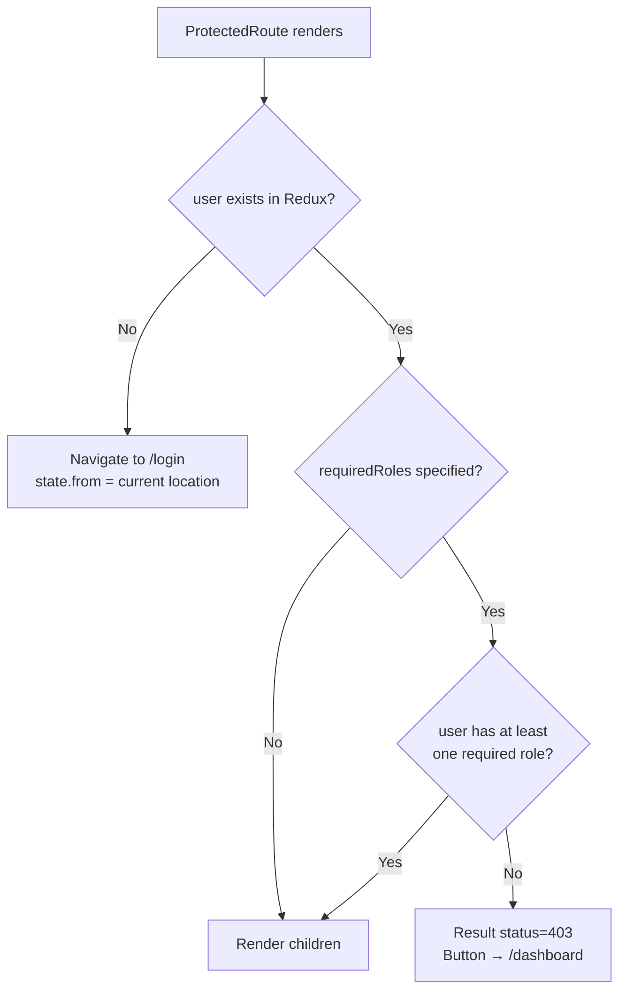
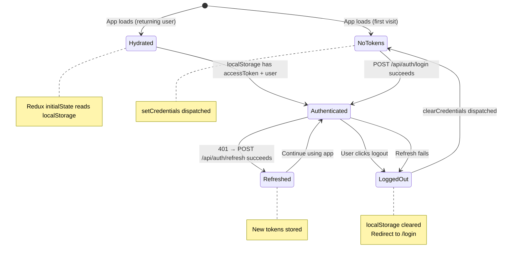

# 10 - Security Reference (Frontend)

## Overview

This document consolidates all authentication constants, token handling, device tracking, role/permission management, and route protection logic used across the frontend.

---

## Auth Constants

### localStorage Keys

| Key | Type | Set By | Cleared By | Purpose |
|-----|------|--------|------------|---------|
| `accessToken` | `string` | `setCredentials` | `clearCredentials` | JWT for API Authorization header |
| `refreshToken` | `string` | `setCredentials` | `clearCredentials` | Token for silent refresh on 401 |
| `user` | `JSON string` | `setCredentials` | `clearCredentials` | Serialized `User` object for Redux hydration |
| `deviceId` | `string` | `getOrCreateDeviceId()` | Never cleared | Stable browser UUID for session tracking |

### Redux Auth State

```typescript
interface AuthState {
  user: User | null;
  accessToken: string | null;
  isInitialized: boolean;  // Always true after initial localStorage read
}
```

Note: `refreshToken` is intentionally **not** stored in Redux state -- it is only in localStorage. This reduces the surface area for accidental exposure via Redux DevTools or state serialization.

---

## JWT Token Structure

The frontend parses the JWT payload client-side (without signature verification) to extract claims. The backend's JWT contains:

| Claim | JWT Key | FE Parser | Used For |
|-------|---------|-----------|----------|
| User ID | `sub` | Not parsed | — |
| Email | `email` | Not parsed | — |
| Username | `name` | Not parsed | — |
| Device ID | `deviceId` | Not parsed | — |
| Roles | `roles` or `role` | `parseRolesFromToken()` | Role-based routing, ProtectedRoute |
| Permissions | `permission` | `parsePermissionsFromToken()` | Fine-grained access control |
| Issued At | `iat` | Not parsed | — |
| Token ID | `jti` | Not parsed | — |

### parseRolesFromToken(token)

```
Input:  JWT string
Output: UserRole[]

1. Split by '.', take index [1] (payload)
2. Base64url decode → JSON parse
3. Read 'roles' or 'role' claim
4. If string, wrap in array
5. Filter against valid UserRole values
6. Fallback: ['bidder'] on any error
```

### parsePermissionsFromToken(token)

```
Input:  JWT string
Output: string[]

1. Same decode as roles
2. Read 'permission' claim (singular)
3. If string, wrap in array
4. Fallback: [] on any error
```

---

## Device ID Generation

`getOrCreateDeviceId()` in `authService.ts`:

```
1. Check localStorage.getItem('deviceId')
2. If exists → return it
3. If not → generate UUID v4 pattern:
   'xxxxxxxx-xxxx-4xxx-yxxx-xxxxxxxxxxxx'
   where x = random hex, y = (random & 0x3 | 0x8)
4. Store in localStorage
5. Return
```

The device ID:
- Persists across login/logout cycles
- Persists across browser sessions (localStorage)
- Is cleared only if the user clears browser data
- Is sent with: login, refresh, and logout requests
- Backend uses it for: session binding, device mismatch detection, per-device revocation

---

## Role Constants

### UserRole Type

```typescript
type UserRole =
  | 'user'
  | 'guest'
  | 'bidder'
  | 'seller'
  | 'moderator'
  | 'risk_manager'
  | 'support'
  | 'marketing'
  | 'admin'
  | 'super_admin';
```

### STAFF_ROLES

```typescript
const STAFF_ROLES: UserRole[] = [
  'moderator', 'risk_manager', 'support',
  'marketing', 'admin', 'super_admin',
];
```

### Role-Based Default Routes

After login, the user is redirected based on their highest-priority role:

| Role | Route |
|------|-------|
| `admin` or `super_admin` | `/admin` |
| `moderator` | `/moderator` |
| `risk_manager` | `/risk` |
| `support` | `/support` |
| `marketing` | `/marketing` |
| All others | `/dashboard` |

---

## Auth Guard: ProtectedRoute

`components/common/ProtectedRoute.tsx` wraps routes that require authentication and/or specific roles.

### Behavior



### Props

| Prop | Type | Required | Description |
|------|------|----------|-------------|
| `children` | `ReactNode` | Yes | The layout/page to render when authorized |
| `requiredRoles` | `UserRole[]` | No | If set, user must have at least one of these roles |

### Route Protection Map

| Route Pattern | Required Roles |
|---------------|---------------|
| `/dashboard`, `/wallet`, `/profile`, etc. | Any authenticated user |
| `/moderator` | `moderator` |
| `/risk` | `risk_manager` |
| `/support` | `support` |
| `/marketing` | `marketing` |
| `/admin/*` | `admin` or `super_admin` |

### Redirect Preservation

When an unauthenticated user is sent to `/login`, the current location is passed via React Router's `state`:

```typescript
<Navigate to="/login" state={{ from: location }} replace />
```

After login, `LoginPage` reads this state and redirects back:

```typescript
const intendedPath = (location.state as { from?: { pathname: string } })?.from?.pathname;
```

---

## Axios Configuration

### Main Instance (`api` in `services/api.ts`)

| Setting | Value |
|---------|-------|
| Base URL | `VITE_API_BASE_URL` env var, fallback `http://localhost:8080` |
| Content-Type | `application/json` |
| Timeout | 15,000 ms |
| Request interceptor | Attaches `Bearer {accessToken}` from Redux |
| Response interceptor | Silent refresh on 401 with queue |

### Auth Instance (`authAxios` in `services/authService.ts`)

| Setting | Value |
|---------|-------|
| Base URL | Same as main instance |
| Content-Type | `application/json` |
| Timeout | 15,000 ms |
| Interceptors | None |

The auth instance is separate to prevent the refresh call from triggering another 401 intercept.

---

## Token Lifecycle



---

## Security Considerations

| Area | Implementation | Notes |
|------|---------------|-------|
| Token storage | localStorage | Vulnerable to XSS but standard for SPAs. httpOnly cookies would require backend changes. |
| Token in memory | Redux state (`accessToken`) | Cleared on page refresh, then restored from localStorage |
| Refresh token | localStorage only | Not in Redux state to reduce exposure |
| JWT verification | Not done client-side | FE trusts the backend; only decodes for claims |
| Device binding | `deviceId` in localStorage | Backend validates device consistency during refresh |
| CSRF | Not applicable | Token-based auth (no cookies sent automatically) |
| XSS protection | React's built-in escaping | No `dangerouslySetInnerHTML` in auth components |

---

## Source Files

| Category | File |
|----------|------|
| Auth service | `services/authService.ts` |
| User service | `services/userService.ts` |
| Axios config | `services/api.ts` |
| Redux slice | `features/auth/authSlice.ts` |
| Route guard | `components/common/ProtectedRoute.tsx` |
| Route config | `routes/index.tsx` |
| Types | `types/index.ts` |
| Hooks | `hooks/useUser.ts` |
