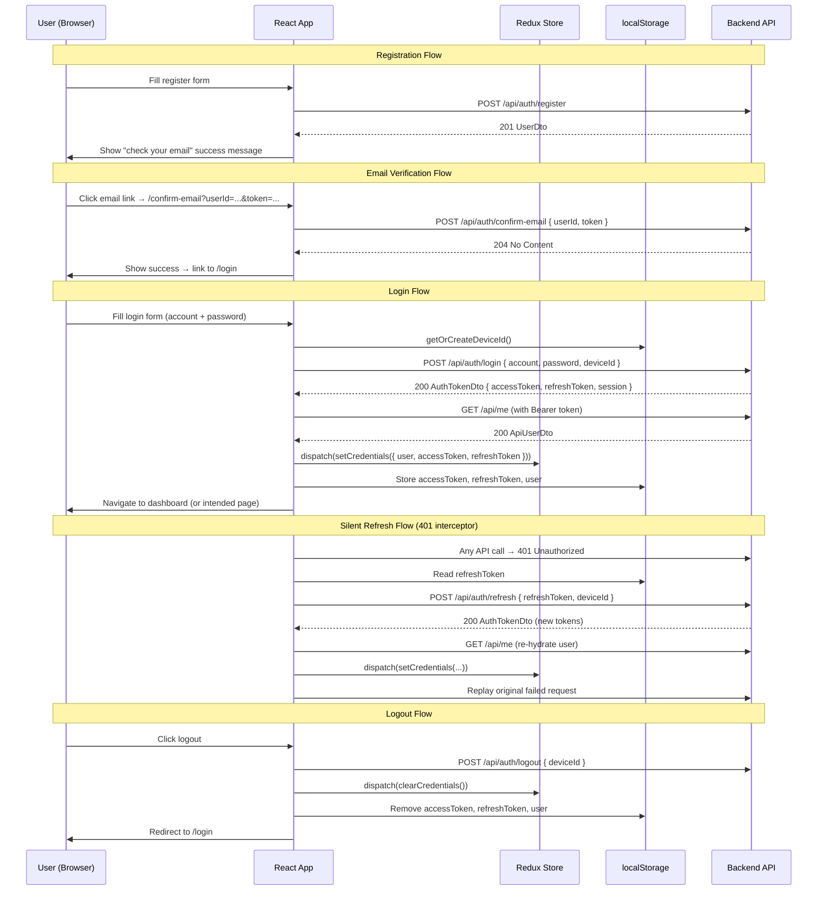

# Registration & Authentication — Frontend Module

## Overview

This module handles the full authentication lifecycle on the frontend: registration, email verification, login, token management, logout, password change, two-factor authentication, and session management. All API calls are centralized in `authService.ts` and `userService.ts`, with Redux Toolkit managing auth state and TanStack Query managing server-fetched security data.

---

## Implementation Status

| Feature | Status | Notes |
|---------|--------|-------|
| Registration | Implemented | RegisterPage with Zod validation |
| Email Verification | Implemented | ConfirmEmailPage reads URL params |
| Login | Implemented | LoginPage with device ID tracking |
| Refresh Token (silent) | Implemented | Axios 401 interceptor with queue |
| Forgot / Reset Password | Not implemented | Link exists on LoginPage, no page built |
| Logout | Implemented | Via authService + Redux clearCredentials |
| TOTP 2FA (enable/disable) | Partial | Toggle switch only, no QR/confirm flow |
| Session Management | Implemented | SessionsTab with table + login history |
| Change Password | Implemented | ChangePasswordSection in SecurityTab |
| Security Reference | N/A | Consolidated reference doc |

---

## User Flow Diagram



---

## Component Hierarchy

```
App
├── PublicLayout
│   ├── LoginPage                    → /login
│   ├── RegisterPage                 → /register
│   └── ConfirmEmailPage             → /confirm-email
├── ProtectedRoute
│   └── AppLayout
│       └── ProfilePage              → /profile
│           ├── SecurityTab
│           │   ├── ChangePasswordSection
│           │   ├── PhoneNumberSection
│           │   └── TwoFactorSection
│           └── SessionsTab
└── (Axios interceptor in api.ts — invisible, handles silent refresh)
```

---

## Pages & Routes

| Route | Page Component | Layout | Auth Required |
|-------|---------------|--------|---------------|
| `/login` | `LoginPage` | PublicLayout | No |
| `/register` | `RegisterPage` | PublicLayout | No |
| `/confirm-email` | `ConfirmEmailPage` | PublicLayout | No |
| `/profile` | `ProfilePage` (SecurityTab, SessionsTab) | AppLayout | Yes |
| `/forgot-password` | Not implemented | — | — |

---

## API Endpoints Consumed

### From `authService.ts`

| Function | Method | Endpoint | Auth |
|----------|--------|----------|------|
| `login()` | POST | `/api/auth/login` | No |
| `register()` | POST | `/api/auth/register` | No |
| `logout()` | POST | `/api/auth/logout` | No (fire-and-forget) |
| `refreshToken()` | POST | `/api/auth/refresh` | Bearer (expired allowed) |
| `confirmEmail()` | POST | `/api/auth/confirm-email` | No |
| `getMe()` | GET | `/api/me` | Bearer |

### From `userService.ts` (security-related)

| Function | Method | Endpoint | Auth |
|----------|--------|----------|------|
| `changePassword()` | PUT | `/api/me/password` | Bearer |
| `enableTwoFactor()` | POST | `/api/me/two-factor/enable` | Bearer |
| `disableTwoFactor()` | POST | `/api/me/two-factor/disable` | Bearer |
| `getSessions()` | GET | `/api/me/sessions` | Bearer |
| `getLoginHistory()` | GET | `/api/me/login-history` | Bearer |
| `setPhoneNumber()` | PUT | `/api/me/phone` | Bearer |
| `confirmPhone()` | POST | `/api/me/phone/confirm` | Bearer |

---

## State Management

### Redux (`authSlice`)

Auth state is global client state managed by Redux Toolkit. It determines routing, API headers, and sidebar visibility across the entire app.

| Field | Type | Purpose |
|-------|------|---------|
| `user` | `User \| null` | Current logged-in user (id, email, fullName, roles, etc.) |
| `accessToken` | `string \| null` | JWT for API Authorization header |
| `isInitialized` | `boolean` | Whether localStorage hydration is complete |

**Actions:**
- `setCredentials({ user, accessToken, refreshToken })` — after login or token refresh
- `clearCredentials()` — after logout or refresh failure
- `updateUser(user)` — after profile update

**Persistence:** `accessToken`, `refreshToken`, and serialized `user` are stored in `localStorage` and restored on app initialization.

### TanStack Query (server state)

| Query Key | Hook | Service Function |
|-----------|------|-----------------|
| `['user', 'me']` | `useCurrentUser()` | `getMe()` |
| `['user', 'sessions', page, pageSize]` | `useSessions()` | `getSessions()` |
| `['user', 'login-history', page, pageSize]` | `useLoginHistory()` | `getLoginHistory()` |

| Mutation | Hook | Service Function |
|----------|------|-----------------|
| Change password | `useChangePassword()` | `changePassword()` |
| Enable 2FA | `useEnableTwoFactor()` | `enableTwoFactor()` |
| Disable 2FA | `useDisableTwoFactor()` | `disableTwoFactor()` |

---

## Subflow Index

| # | File | Description | Status |
|---|------|-------------|--------|
| 01 | [01-registration.md](./01-registration.md) | New account registration | Implemented |
| 02 | [02-email-verification.md](./02-email-verification.md) | Email confirmation page | Implemented |
| 03 | [03-login.md](./03-login.md) | Login with device tracking | Implemented |
| 04 | [04-refresh-token.md](./04-refresh-token.md) | Silent 401 refresh interceptor | Implemented |
| 05 | [05-forgot-reset-password.md](./05-forgot-reset-password.md) | Forgot / reset password | Not Implemented |
| 06 | [06-logout.md](./06-logout.md) | Logout flow | Implemented |
| 07 | [07-totp-2fa.md](./07-totp-2fa.md) | Two-factor authentication toggle | Partial |
| 08 | [08-session-management.md](./08-session-management.md) | Active sessions + login history | Implemented |
| 09 | [09-change-password.md](./09-change-password.md) | Change password form | Implemented |
| 10 | [10-security-reference.md](./10-security-reference.md) | Auth constants, guards, JWT parsing | Reference |

---

## Key Source Files

| Layer | File | Purpose |
|-------|------|---------|
| Service | `services/authService.ts` | Auth API calls + deviceId + JWT parser + user mapper |
| Service | `services/userService.ts` | Profile, addresses, security API calls |
| Service | `services/api.ts` | Axios instance with 401 interceptor |
| State | `features/auth/authSlice.ts` | Redux auth state + localStorage persistence |
| Hook | `hooks/useUser.ts` | TanStack Query hooks for profile, sessions, security |
| Page | `pages/public/LoginPage.tsx` | Login form |
| Page | `pages/public/RegisterPage.tsx` | Registration form |
| Page | `pages/public/ConfirmEmailPage.tsx` | Email confirmation handler |
| Component | `components/profile/SecurityTab.tsx` | Composes security sections |
| Component | `components/profile/SessionsTab.tsx` | Sessions table + login history |
| Component | `components/profile/ChangePasswordSection.tsx` | Password change form |
| Component | `components/profile/TwoFactorSection.tsx` | 2FA enable/disable toggle |
| Component | `components/common/ProtectedRoute.tsx` | Auth guard for routes |
| Types | `types/index.ts` | Auth types, DTOs, request/response shapes |
| Routes | `routes/index.tsx` | Route definitions with auth guards |
| i18n | `locales/en/common.json` (`auth.*`) | English translation keys |
| i18n | `locales/vi/common.json` (`auth.*`) | Vietnamese translation keys |

---

## Not Yet Implemented

| Feature | BE Endpoint | Notes |
|---------|-------------|-------|
| Forgot Password page | `POST /api/auth/forgot-password` | LoginPage has link to `/forgot-password` but no page exists |
| Reset Password page | `POST /api/auth/reset-password` | Would need a page at `/reset-password?email=...&token=...` |
| TOTP QR setup flow | `POST /api/me/two-factor/setup` | FE only has enable/disable toggle, no QR code scan UI |
| TOTP confirm flow | `POST /api/me/two-factor/confirm` | No confirm code modal after QR scan |
| 2FA login verification | `POST /api/auth/two-factor/verify` | LoginPage does not handle `requiresTwoFactor: true` response |
| Recovery codes display | `POST /api/me/two-factor/recovery-codes` | No UI for viewing/regenerating recovery codes |
| Resend confirmation email | `POST /api/auth/resend-confirm-email` | No UI — ConfirmEmailPage only handles the confirm link |
| Session revocation | `POST /api/auth/logout` (specific device) | SessionsTab displays sessions but has no "revoke" button |
