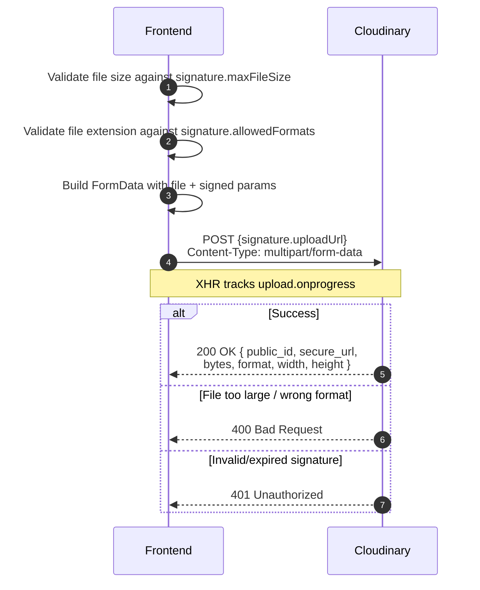

# 02 -- Client Upload to Cloudinary

> **Status**: Implemented
> **BE docs**: `backend/docs/flows/04-media-upload/02-client-upload.md`

## Overview

Step 2 of the 3-step upload flow. This step is **entirely client-side** -- no BE call is made. The FE takes the signed parameter bundle from step 1 and uploads the file directly to Cloudinary via a multipart `POST` request. Upload progress is tracked via `XMLHttpRequest` events.

---

## Sequence



---

## FE Implementation

**File**: `src/services/mediaService.ts` -- `uploadToCloudinary()`

The function uses `XMLHttpRequest` instead of `fetch` or Axios because XHR supports `upload.onprogress` events for real-time progress tracking.

```typescript
async function uploadToCloudinary(
  file: File,
  signature: UploadSignatureResponse,
  onProgress?: UploadProgressCallback
): Promise<CloudinaryUploadResult>
```

### FormData Construction

The following fields are appended to the `FormData` body:

| FormData Field | Source | Always Sent |
|---------------|--------|-------------|
| `file` | The user's `File` object | Yes |
| `api_key` | `signature.apiKey` | Yes |
| `timestamp` | `String(signature.timestamp)` | Yes |
| `signature` | `signature.signature` | Yes |
| `public_id` | `signature.publicId` | Yes |
| `folder` | `signature.folder` | Yes |
| `eager` | `signature.eager` | Only if truthy |
| `allowed_formats` | `signature.allowedFormats.join(',')` | Only if array is non-empty |

**Note**: The FE does not currently send `eager_async` for video contexts. This is acceptable because `item_image` (the only context currently used) is an image context where `eager_async` is not signed.

### Upload URL

The URL comes directly from `signature.uploadUrl`. For the `item_image` context:

```
https://api.cloudinary.com/v1_1/dt2b5qfoe/image/upload
```

---

## Progress Tracking

The `onProgress` callback receives a percentage (0-100) calculated from XHR's `upload.progress` event:

```typescript
xhr.upload.addEventListener('progress', (event) => {
  if (event.lengthComputable) {
    onProgress(Math.round((event.loaded / event.total) * 100));
  }
});
```

In `CreateItemPage`, progress tracking is not wired to a progress bar -- the page shows a loading spinner on the upload button instead. The `onProgress` callback is available for future enhancement.

---

## Client-Side Validation

The `uploadMedia()` orchestrator validates **before** calling `uploadToCloudinary()`:

| Check | Code | Error thrown |
|-------|------|-------------|
| File size | `file.size > signature.maxFileSize` | `"File too large: X.XMB exceeds max YMB"` |
| File format | `!signature.allowedFormats.includes(extension)` | `"File format "ext" not allowed. Accepted: ..."` |

These checks prevent wasting bandwidth on uploads that Cloudinary would reject.

---

## Cloudinary Response

On success, Cloudinary returns JSON. The FE maps it to `CloudinaryUploadResult`:

```typescript
interface CloudinaryUploadResult {
  public_id: string;    // Full path: "items/pending/{userId}/img_abc123def456"
  secure_url: string;   // HTTPS URL to the uploaded resource
  bytes: number;        // File size in bytes
  format: string;       // File format (e.g., "jpg")
  width: number;        // Image width in pixels
  height: number;       // Image height in pixels
  resource_type: string;// "image", "video", or "raw"
  duration?: number;    // Video duration in seconds (undefined for images)
}
```

**Important**: Cloudinary's `public_id` includes the full folder path (e.g., `items/pending/{userId}/img_abc123def456`), while the signature's `publicId` is just the leaf (e.g., `img_abc123def456`). Step 3 uses `signature.publicId` (not Cloudinary's) to avoid a `PublicIdMismatch` error.

---

## Error Scenarios

| Scenario | HTTP | FE Handling |
|----------|------|-------------|
| File too large | 400 from Cloudinary | `Promise.reject()` with error message |
| Wrong format | 400 from Cloudinary | `Promise.reject()` with error message |
| Invalid signature | 401 from Cloudinary | `Promise.reject()` with error message |
| Expired timestamp | 401 from Cloudinary | `Promise.reject()` -- signature was requested > 30 min ago |
| Network error | N/A | XHR `error` event triggers `Promise.reject()` |

All errors are caught by `uploadMedia()` and propagated to the calling page component.

---

## Source Files

| File | What it does |
|------|-------------|
| `src/services/mediaService.ts` | `uploadToCloudinary()` function, `CloudinaryUploadResult` type, `UploadProgressCallback` type |
