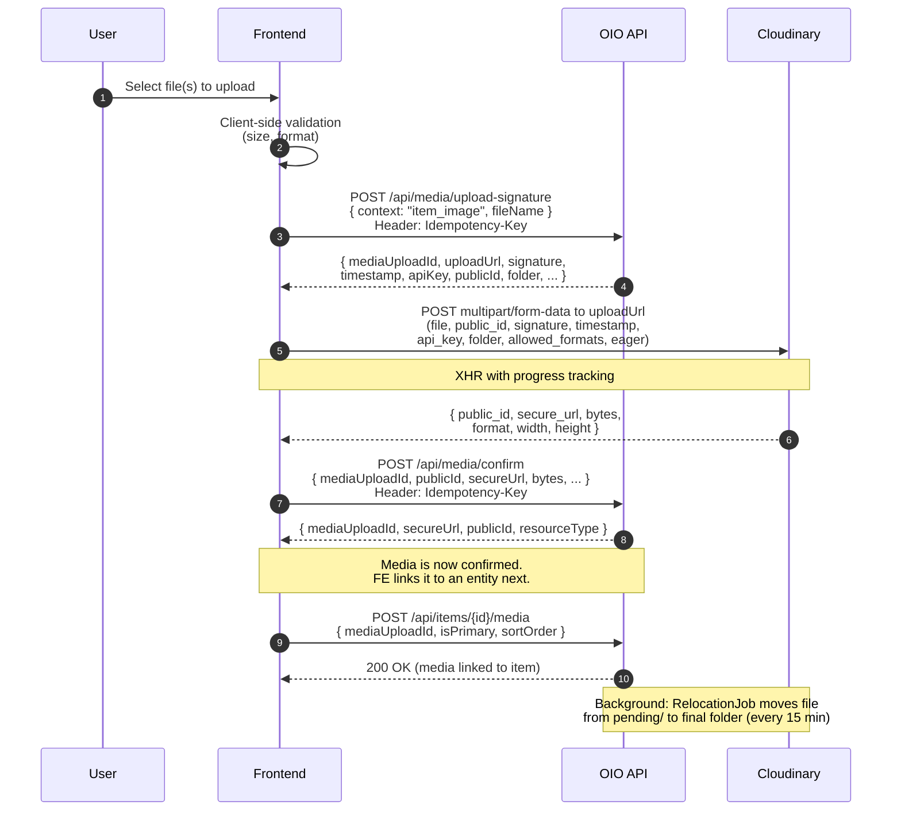

# 04 -- Media Upload

> **Status**: Implemented
> **BE docs**: `backend/docs/flows/04-media-upload/`

## Overview

The platform uses a **3-step Cloudinary signed direct upload** pattern. The backend never receives file bytes. Instead:

1. **FE requests a signature** from BE (`POST /api/media/upload-signature`)
2. **FE uploads the file directly to Cloudinary** using the signed params
3. **FE confirms the upload** with BE (`POST /api/media/confirm`)

After confirmation, the media is linked to an entity (e.g., item) via a separate endpoint (e.g., `POST /api/items/{id}/media`). BE handles relocation and cleanup in the background -- FE does not participate in those steps.

---

## Sequence Diagram

---

## API Endpoints Consumed

| Method | Path | Purpose | FE Function |
|--------|------|---------|-------------|
| `POST` | `/api/media/upload-signature` | Get signed Cloudinary upload params | `mediaService.getUploadSignature()` |
| `POST` | `/api/media/confirm` | Confirm upload with Cloudinary metadata | `mediaService.confirmUpload()` |
| `POST` | `/api/items/{id}/media` | Link confirmed media to an item | `addItemMedia()` |

Both media endpoints require an `Idempotency-Key` header (generated via `crypto.randomUUID()`).

---

## Where Uploads Are Used

| Feature | Context String | Page / Component |
|---------|---------------|------------------|
| Item creation (images) | `item_image` | `CreateItemPage` |

Currently, `item_image` is the only upload context used in the FE. Other contexts defined by BE (`user_avatar`, `item_video`, `verification_document`, etc.) are not yet implemented on the frontend.

---

## Subflow Index

| # | File | Topic | Status |
|---|------|-------|--------|
| 1 | [01-request-signature.md](./01-request-signature.md) | Request upload signature from BE | Implemented |
| 2 | [02-client-upload.md](./02-client-upload.md) | Direct upload to Cloudinary | Implemented |
| 3 | [03-confirm-upload.md](./03-confirm-upload.md) | Confirm upload with BE | Implemented |
| 4 | [04-background-jobs.md](./04-background-jobs.md) | BE background jobs (relocation, cleanup) | BE-only |
| 5 | [05-upload-contexts-reference.md](./05-upload-contexts-reference.md) | Upload contexts and where they are used | Reference |

---

## Source Files

| File | Purpose |
|------|---------|
| `src/services/mediaService.ts` | 3-step upload orchestration (signature, Cloudinary upload, confirm) |
| `src/pages/seller/CreateItemPage.tsx` | Uses `mediaService.uploadMedia()` for item image uploads |
| `src/services/auctionService.ts` | `addItemMedia()` -- links confirmed media to an item |
| `src/components/auction/ImageGallery.tsx` | Displays uploaded item images (read-only, no upload logic) |
| `src/types/item.ts` | `ItemImage` interface (id, imageUrl, isPrimary, sortOrder) |
| `src/types/index.ts` | `ApiResponse<T>` wrapper type |

---

## Key Design Decisions

1. **No file proxying**: Files go directly from the browser to Cloudinary. The BE only signs the request and confirms the result. This avoids backend bandwidth/memory costs.

2. **XHR for progress**: The Cloudinary upload uses `XMLHttpRequest` (not `fetch` or Axios) to support `upload.onprogress` events for real-time progress tracking.

3. **Idempotency keys**: Both BE calls use `crypto.randomUUID()` as the idempotency key. This means retries always create new signatures/confirmations -- the FE does not cache or reuse keys.

4. **Public ID passthrough**: When confirming, the FE sends `signature.publicId` (the leaf name from step 1) rather than Cloudinary's `public_id` (which includes the folder prefix). This avoids a `PublicIdMismatch` error from the BE's fuzzy matching.
