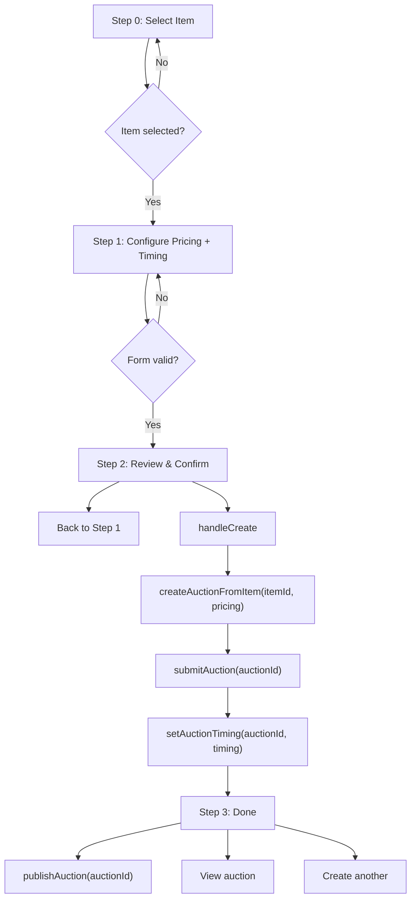

# 01 - Create Auction (Frontend)

## Status: Implemented

---

## Overview

Step 1 of the 3-step auction creation flow. The seller selects an approved/active item, configures pricing, and the FE calls `POST /api/items/{itemId}/auctions` to create a **Draft** auction with pricing only (no timing at this stage).

This is implemented in `CreateAuctionPage` as a 4-step wizard (select item -> configure -> review -> done). The actual BE call happens in step 2 (review & confirm) of the wizard, not step 1.

---

## API Call

| Step | Function | Method | Endpoint | Purpose |
|------|----------|--------|----------|---------|
| 1 | `createAuctionFromItem()` | POST | `/api/items/{itemId}/auctions` | Create draft auction with pricing |

Defined in `src/services/auctionService.ts`.

---

## Request Schema

```typescript
// src/types/auction.ts
interface CreateAuctionFromItemRequest {
  startingPrice: number;
  bidIncrement: number;
  reservePrice?: number;
  buyNowPrice?: number;
  extensionMinutes?: number;  // 1-30, default 5
  currency?: string;          // 3 chars, default "VND"
  auctionType?: string;       // "regular" | "sealed", default "regular"
}
```

### FE Validation (Ant Design Form rules)

| Field | Rule | Error Key |
|-------|------|-----------|
| `startingPrice` | Required, min 1000 | `createAuction.startingPriceRequired`, `createAuction.priceMinimum` |
| `bidIncrement` | Required, min 1000 | `createAuction.bidIncrementRequired`, `createAuction.priceMinimum` |
| `reservePrice` | Optional, must be >= startingPrice | `createAuction.reservePriceTooLow` |
| `buyNowPrice` | Optional, must be >= startingPrice | `createAuction.buyNowPriceTooLow` |
| `extensionMinutes` | Required when autoExtend=true, 1-30 | `createAuction.extensionMinutesRequired`, `createAuction.extensionMinutesRange` |

### BE Validation (from CreateAuctionCommand.Validate())

| Field | Rule |
|-------|------|
| `startingPrice` | Non-negative |
| `bidIncrement` | Non-negative |
| `reservePrice` | When provided: >= startingPrice |
| `buyNowPrice` | When provided: >= startingPrice |
| `extensionMinutes` | Between 1 and 30 inclusive |
| `currency` | Exactly 3 characters |
| `auctionType` | Must be `regular` or `sealed` |

---

## Response Handling

```typescript
// auctionService.ts — createAuctionFromItem()
const { data } = await api.post(`/api/items/${itemId}/auctions`, request);
const result = (data as Record<string, unknown>)?.data ?? data;
return { id: (result as Record<string, unknown>).id as string };
```

The BE returns an `AuctionDto` (full auction object). The FE extracts only the `id` field, which is needed for the subsequent submit and timing calls.

---

## Wizard Flow (CreateAuctionPage.tsx)



---

## Item Selection (Step 0)

The wizard first loads the seller's items via `useMyItems()` and filters to only show items with status `active` or `approved`:

```typescript
const availableItems = useMemo(
  () => items.filter((item) => item.status === 'active' || item.status === 'approved'),
  [items],
);
```

If a `routeItemId` is provided via URL param (`/create-auction/:itemId`), step 0 is skipped and the wizard starts at step 1.

---

## Hooks Used

| Hook | Source | Purpose |
|------|--------|---------|
| `useMyItems()` | `useSellerManagement.ts` | Fetch seller's items for selection |
| `useCreateAuction()` | `useSellerManagement.ts` | Mutation: POST create auction |
| `useSetAuctionTiming()` | `useSellerManagement.ts` | Mutation: PUT set timing |
| `useSubmitAuction()` | `useSellerManagement.ts` | Mutation: POST submit auction |
| `usePublishAuction()` | `useSellerManagement.ts` | Mutation: POST publish auction |

All mutations invalidate `['myItems']` and/or `['myAuctions']` cache keys on success.

---

## Error Handling

Errors from the BE are extracted from the Axios error response and displayed via `message.error()`:

```typescript
const errorMsg = axios.isAxiosError(err)
  ? (err.response?.data?.detail ?? err.response?.data?.title ?? t('common.error'))
  : t('common.error');
message.error(errorMsg);
```

### Known BE Error Codes

| Code | When |
|------|------|
| `Auction.InvalidAuctionType` | auctionType not `regular` or `sealed` |
| `Auction.ItemAlreadyInAuction` | Item already in an active auction |
| `Auction.ItemAlreadyHasAuction` | Item already has a commercial-state auction |
| `Auction.ItemRequiresMedia` | Item must have at least one image |
| `Category.NotFound` | categoryId does not exist |

---

## Source Files

| File | Path |
|------|------|
| Page | `src/pages/seller/CreateAuctionPage.tsx` |
| Service | `src/services/auctionService.ts` (createAuctionFromItem) |
| Hook | `src/hooks/useSellerManagement.ts` (useCreateAuction) |
| Request type | `src/types/auction.ts` (CreateAuctionFromItemRequest) |
| Response type | `src/types/auction.ts` (CreateAuctionFromItemResponse) |

---

## BE Reference

See `backend/docs/flows/06-auction-lifecycle/01-create-auction.md` for full BE handler flow, domain events (`AuctionCreatedEvent`), and `AuctionDto` shape.
