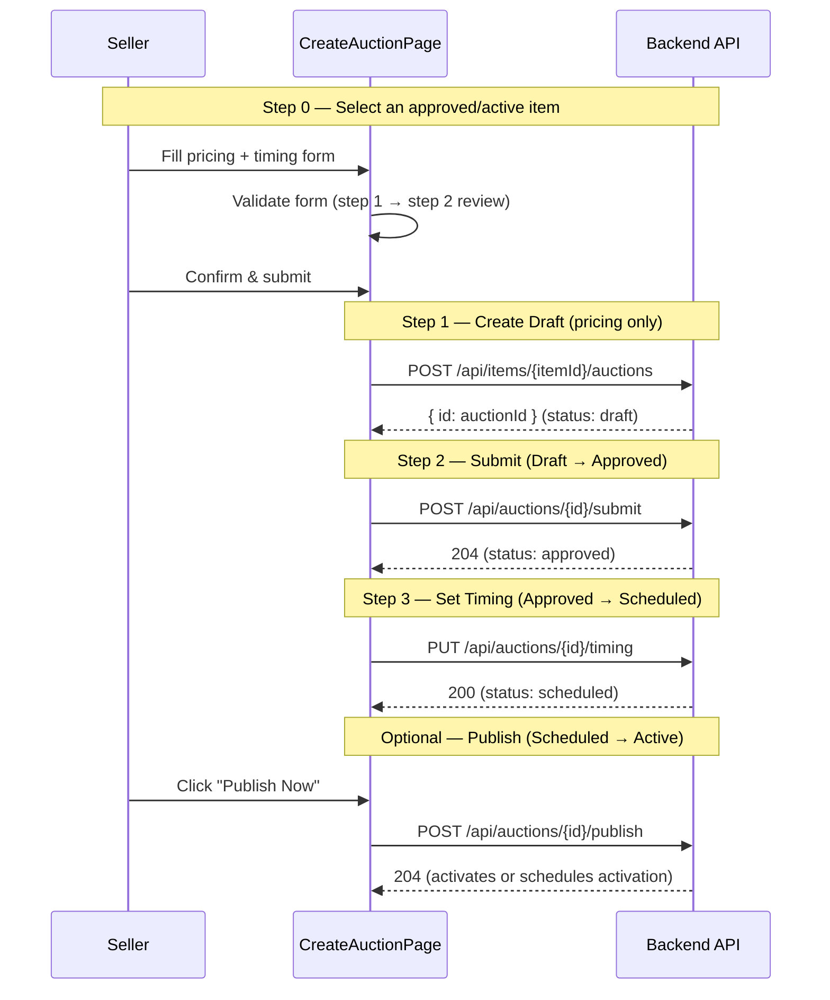

# 06 - Auction Lifecycle (Frontend)

## Status: Partial

- **Create / Timing / Submit / Publish**: Implemented (CreateAuctionPage, MyListingsPage)
- **Browse / Detail / My Auctions**: Implemented (BrowsePage, AuctionDetailPage, MyListingsPage)
- **SignalR real-time events**: Implemented (auctionHubService.ts)
- **End / Cancel / Relist / Runner-up / Admin ops**: Not implemented in FE

---

## 3-Step Auction Creation Flow

The FE implements a 3-step flow to create and schedule an auction. This is the critical path documented across `01-create-auction.md`, `02-update-timing.md`, and `03-submit-publish.md`.



---

## Component Hierarchy

```
CreateAuctionPage (seller/CreateAuctionPage.tsx)
├── Step 0: Item selector (Radio.Group of ItemCard)
├── Step 1: Auction settings form (pricing, timing, anti-sniping)
├── Step 2: Review & confirm (Descriptions summary)
└── Step 3: Done (publish button, view auction link)

MyListingsPage (seller/MyListingsPage.tsx)
├── Tab: My Items (Table with submit/create-auction actions)
└── Tab: My Auctions (Table with submit/publish actions, status filter)

BrowsePage (public/BrowsePage.tsx)
├── BrowseSidebar (layout/Browsesidebar.tsx)
│   └── Filters: search, categories, status, price range, verified, ending soon
└── AuctionCard grid (components/auction/AuctionCard.tsx)
    └── Live countdown timer (active auctions only)

AuctionDetailPage (public/AuctionDetailPage.tsx)
├── ImageGallery
├── BiddingPanel (deposit, bid, buy-now, watch, auto-bid)
└── BidHistoryList
```

---

## Routes

| Path | Component | Auth | Purpose |
|------|-----------|------|---------|
| `/browse` | `BrowsePage` | Public | Browse/search all auctions |
| `/auction/:id` | `AuctionDetailPage` | Public | Auction detail with bidding |
| `/my-listings` | `MyListingsPage` | Seller | Manage items + auctions |
| `/create-auction` | `CreateAuctionPage` | Seller | 4-step auction wizard |
| `/create-auction/:itemId` | `CreateAuctionPage` | Seller | Pre-selected item variant |

---

## API Endpoints Consumed

### Auction Lifecycle (auctionService.ts)

| Function | Method | Endpoint | Purpose |
|----------|--------|----------|---------|
| `createAuctionFromItem()` | POST | `/api/items/{itemId}/auctions` | Create draft auction (pricing only) |
| `setAuctionTiming()` | PUT | `/api/auctions/{id}/timing` | Set qualification + start/end times |
| `submitAuction()` | POST | `/api/auctions/{id}/submit` | Submit draft (Draft -> Approved) |
| `publishAuction()` | POST | `/api/auctions/{id}/publish` | Publish scheduled auction |
| `getAuctions()` | GET | `/api/auctions` | Public paginated list (Browse page) |
| `getAuctionById()` | GET | `/api/auctions/{id}` | Full auction detail |
| `getMyAuctions()` | GET | `/api/me/auctions` | Seller's own auctions |

### Admin (adminService.ts)

| Function | Method | Endpoint | Purpose |
|----------|--------|----------|---------|
| `setAuctionCuration()` | PUT | `/api/admin/auctions/{id}/curation` | Assign admin, priority, featured |
| `triggerAuctionEmergency()` | POST | `/api/admin/auctions/{id}/emergencies` | Trigger emergency |
| `resolveAuctionEmergency()` | POST | `/api/admin/auctions/{id}/emergencies/{eid}/resolve` | Resolve emergency |
| `revealSealedBid()` | POST | `/api/admin/auctions/{id}/sealed-bids/{sid}/reveal` | Reveal sealed bid |

---

## SignalR Events (auctionHubService.ts)

The FE listens for these server-to-client events via the AuctionHub:

| Event | Type | Description |
|-------|------|-------------|
| `BidPlaced` | `BidNotification` | Any bid placed on a watched auction |
| `Outbid` | `OutbidNotification` | Current user was outbid (user-specific) |
| `BuyNowExecuted` | `BuyNowNotification` | Buy-now purchase completed |
| `AuctionStarted` | `AuctionStartedNotification` | Auction activated (Scheduled -> Active) |
| `AuctionEnded` | `AuctionEndedNotification` | Auction ended (timer or buy-now) |
| `AuctionExtended` | `AuctionExtendedNotification` | Anti-sniping timer extension |
| `AuctionCancelled` | `AuctionCancelledNotification` | Auction cancelled by admin |
| `PriceUpdated` | `PriceUpdateNotification` | Periodic price/time sync |
| `Error` | `HubErrorNotification` | Hub method error |

---

## TanStack Query Cache Keys

| Key | Hook | Service | Stale Time |
|-----|------|---------|------------|
| `['auctions', filters]` | `useAuctions()` | `getAuctions()` | Default (0) |
| `['auction', id]` | `useAuction()` | `getAuctionById()` | Default + 10s poll |
| `['auctionBids', id]` | `useAuctionBids()` | `getAuctionBids()` | Default + 10s poll |
| `['categories']` | `useCategories()` | `getCategories()` | 10 minutes |
| `['myItems', filters]` | `useMyItems(filters)` | `getMyItems(filters)` | Default (0), server-side pagination |
| `['myAuctions', filters]` | `useMyAuctions()` | `getMyAuctions()` | Default (0) |

---

## Subflow Index

| # | File | Status | Topic |
|---|------|--------|-------|
| 0 | [README.md](./README.md) | -- | This overview |
| 1 | [01-create-auction.md](./01-create-auction.md) | Implemented | Create draft auction (pricing) |
| 2 | [02-update-timing.md](./02-update-timing.md) | Implemented | Set timing + qualification window |
| 3 | [03-submit-publish.md](./03-submit-publish.md) | Implemented | Submit + publish auction |
| 4 | [03a-auction-review.md](./03a-auction-review.md) | Partial | Admin item review (approve/reject) |
| 5 | [04-activation.md](./04-activation.md) | BE-Only | Scheduled -> Active (background job) |
| 6 | [05-auto-extension.md](./05-auto-extension.md) | BE-Only | Anti-sniping auto-extension |
| 7 | [06-end-resolve.md](./06-end-resolve.md) | Not Implemented | Auction end + resolution |
| 8 | [07-cancel-close.md](./07-cancel-close.md) | Not Implemented | Cancel + early close |
| 9 | [08-relist.md](./08-relist.md) | Not Implemented | Relist from PaymentDefaulted |
| 10 | [09-runner-up-offer.md](./09-runner-up-offer.md) | Not Implemented | Runner-up offers |
| 11 | [10-admin-operations.md](./10-admin-operations.md) | Not Implemented | Admin auction operations |
| 12 | [11-background-jobs.md](./11-background-jobs.md) | BE-Only | Background jobs + FE SignalR events |
