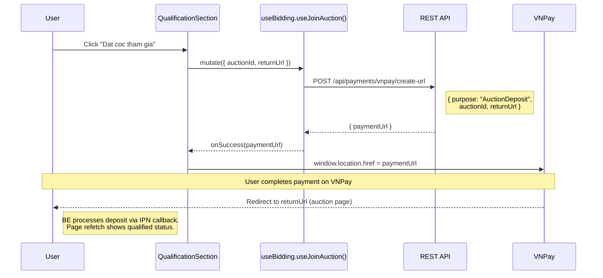

# 01 -- Deposit & Qualification (Frontend)

> **Status**: Implemented
> **Components**: `QualificationSection`
> **Service**: `auctionService.createDepositUrl()`
> **Hook**: `useBidding.useJoinAuction()`

## Overview

Before bidding, users must qualify by paying a deposit via VNPay. The FE handles this as a redirect flow: the user clicks a button, gets redirected to VNPay to pay, and returns to the auction page where the deposit is reflected.

## User Flow



## Component: QualificationSection

**File**: `src/components/auction/QualificationSection.tsx`

### Two States

| State | Condition | Display |
|-------|-----------|---------|
| **Not qualified** | `auction.currentUserDeposit === null` | Deposit amount, wallet balance check, join button |
| **Qualified** | `auction.currentUserDeposit !== null` | Success alert with deposit amount + status tag |

### Not Qualified State

1. Shows deposit amount required via `Alert` (type="info")
2. Checks wallet balance via `useWalletData()` hook (shared cache key `['wallet', 'me']`)
3. If insufficient funds: shows shortfall amount + "Go to Wallet" link button
4. If sufficient: enables the "Dat coc tham gia" join button
5. Button calls `useJoinAuction().mutate()` which redirects to VNPay

### Qualified State

Shows a success `Alert` with:
- Deposit amount in VND
- Deposit status tag (color-coded: held=orange, converted=green, returned=cyan, forfeited=red)
- Message: "ready to bid" (if active) or "waiting for auction to start"

### Deposit Status Display

```typescript
const DEPOSIT_STATUS_KEY: Record<string, string> = {
  held: 'bidding.depositHeld',
  holding: 'bidding.depositHolding',
  converted_to_payment: 'bidding.depositConverted_to_payment',
  applied: 'bidding.depositApplied',
  returned: 'bidding.depositReturned',
  refunded: 'bidding.depositRefunded',
  forfeited: 'bidding.depositForfeited',
};
```

## API Call

| Method | URL | Request Body | Response |
|--------|-----|-------------|----------|
| `POST` | `/api/payments/vnpay/create-url` | `{ purpose: "AuctionDeposit", auctionId, returnUrl }` | `{ paymentUrl: string }` |

**Service function**: `createDepositUrl(auctionId, returnUrl)` in `auctionService.ts`

The response may be wrapped in `{ data: { paymentUrl } }` -- the service handles unwrapping.

## Hook: useJoinAuction

**File**: `src/hooks/useBidding.ts`

```typescript
export function useJoinAuction() {
  return useMutation({
    mutationFn: ({ auctionId, returnUrl }) => createDepositUrl(auctionId, returnUrl),
    // No cache invalidation -- user gets redirected to VNPay.
    // On return, the auction detail page refetches automatically.
  });
}
```

No `onSuccess` cache invalidation because the user leaves the page (VNPay redirect). When they return, the auction query refetches on mount.

## Bypass Deposit (Development)

Both `BiddingPanel` and `BidForm` check `VITE_BYPASS_DEPOSIT` environment variable:

```typescript
const BYPASS_DEPOSIT = import.meta.env.VITE_BYPASS_DEPOSIT !== 'false';
const isQualified = BYPASS_DEPOSIT || auction.currentUserDeposit !== null;
```

Set `VITE_BYPASS_DEPOSIT=false` in `.env` to enforce real deposit flow. Default (unset) bypasses the check for development.

## Known Limitations

- **Qualification window timing**: The FE does not currently check if the qualification window is open before showing the deposit button. The BE validates this and returns an error if the window is closed.
- **Deposit amount calculation**: FE uses `auction.depositAmount` (defaulted to `startingPrice * 0.1`). This is calculated client-side since the BE auction detail response does not include deposit amount.
- **`currentUserDeposit` is always null**: The BE `GET /api/auctions/{id}` response does not include the current user's deposit status. The deposit check relies on the `VITE_BYPASS_DEPOSIT` flag or future BE changes.

## Source Files

| File | Path |
|------|------|
| Component | `src/components/auction/QualificationSection.tsx` |
| Service function | `src/services/auctionService.ts` -- `createDepositUrl()` |
| Hook | `src/hooks/useBidding.ts` -- `useJoinAuction()` |
| Deposit type | `src/types/auction.ts` -- `AuctionDeposit` |
| Deposit status enum | `src/types/enums.ts` -- `DepositStatus` |
