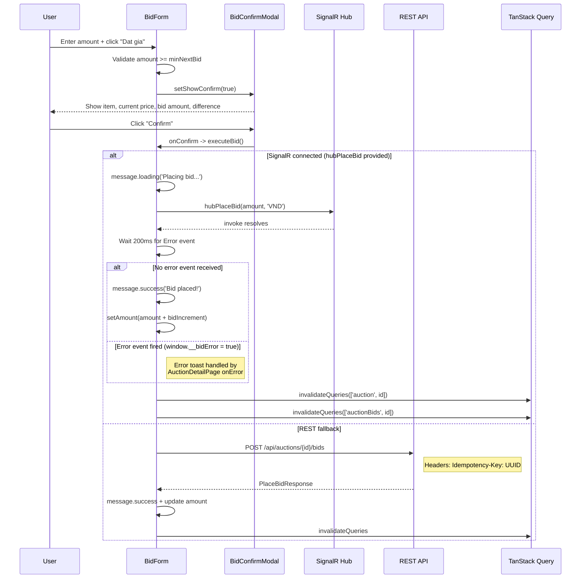

# 02 -- Manual Bid (Frontend)

> **Status**: Implemented
> **Components**: `BidForm`, `BidConfirmModal`, `BidHistoryList`
> **Service**: `auctionService.placeBid()`
> **Hook**: `useBidding.usePlaceBid()`

## Overview

Manual bidding is the primary interactive flow for open (English) auctions. The user enters a bid amount, confirms via a modal, and the bid is placed through SignalR (primary) or REST (fallback). Real-time updates arrive via SignalR events.

## Bid Placement Flow



## Component: BidForm

**File**: `src/components/auction/BidForm.tsx`

### Props

```typescript
interface BidFormProps {
  auction: Auction;
  hubPlaceBid?: (amount: number, currency: string) => Promise<void>;
}
```

### Key Features

| Feature | Implementation |
|---------|---------------|
| **Minimum bid calculation** | Uses BE-computed `auction.minimumBidAmount` (falls back to `currentPrice + bidIncrement`) |
| **VND input formatting** | `InputNumber<number>` with dot separator formatter/parser |
| **Quick-bid buttons** | `+1x`, `+2x`, `+3x` the bid increment (auto-fills the input) |
| **Winning/outbid status** | Green alert if user is winning, orange if outbid |
| **Double-submit prevention** | `useRef(submittingRef)` guards against rapid clicks |
| **Confirmation modal** | `BidConfirmModal` opens before actual submission |

### Minimum Bid Amount Logic

```typescript
const currentPrice = auction.currentPrice ?? auction.startingPrice;
const minNextBid = auction.minimumBidAmount ?? (currentPrice + auction.bidIncrement);
```

The BE computes `minimumBidAmount` as:
- First bid: `startingPrice`
- Subsequent bids: `currentPrice + bidIncrement`

### Winning Detection

```typescript
const winningBid = auction.recentBids?.find((b) => b.status === 'winning');
const highestBid = auction.recentBids?.length
  ? auction.recentBids.reduce((max, b) => (b.amount > max.amount ? b : max))
  : undefined;
const effectiveWinner = winningBid ?? highestBid;
const isWinning = !!userId && effectiveWinner?.bidderId === userId;
```

Uses dual detection: first checks for a bid with `status === 'winning'`, then falls back to highest bid by amount (handles eventual consistency).

### SignalR Error Handling Pattern

The `PlaceBid` SignalR invoke resolves even on business errors (BE sends a separate `Error` event to `Clients.Caller`). The FE uses a cross-component coordination pattern:

1. `BidForm` sets `window.__bidError = false` before invoking
2. Shows a `message.loading()` with key `'bid-toast'`
3. After invoke resolves, waits 200ms for the Error event to arrive
4. `AuctionDetailPage` `onError` handler sets `window.__bidError = true` and replaces the loading toast with an error toast using the same key
5. If no error: `BidForm` replaces the loading toast with a success toast

## Component: BidConfirmModal

**File**: `src/components/auction/BidConfirmModal.tsx`

### Props

```typescript
interface BidConfirmModalProps {
  open: boolean;
  onConfirm: () => void;
  onCancel: () => void;
  auction: Auction;
  bidAmount: number;
  loading?: boolean;
}
```

### Display

- **Item title**: from `auction.item?.title`
- **Current price**: `auction.currentPrice ?? auction.startingPrice`
- **Your bid**: the entered amount (highlighted in blue, font-size 18)
- **Increase**: difference between bid and current price (green text)
- **High-value warning**: if `bidAmount >= 10,000,000 VND`, shows a warning alert
- **Irreversible note**: always shown as info alert

Responsive: full-width on mobile, 480px on desktop.

## API Call (REST Fallback)

| Method | URL | Headers | Request Body | Response |
|--------|-----|---------|-------------|----------|
| `POST` | `/api/auctions/{auctionId}/bids` | `Idempotency-Key: <UUID>` | `{ amount, currency: "VND" }` | `PlaceBidResponse` |

**Service function**: `placeBid(auctionId, amount)` in `auctionService.ts`

The `Idempotency-Key` is generated via `crypto.randomUUID()` per call to prevent duplicate bids on network retries.

## Hook: usePlaceBid

**File**: `src/hooks/useBidding.ts`

```typescript
export function usePlaceBid() {
  const queryClient = useQueryClient();
  return useMutation({
    mutationFn: ({ auctionId, amount }) => placeBid(auctionId, amount),
    onSuccess: (_data, { auctionId }) => {
      queryClient.invalidateQueries({ queryKey: ['auction', auctionId] });
      queryClient.invalidateQueries({ queryKey: ['auctionBids', auctionId] });
      queryClient.invalidateQueries({ queryKey: ['myBids'] });
    },
  });
}
```

## Component: BidHistoryList

**File**: `src/components/auction/BidHistoryList.tsx`

### Props

```typescript
interface BidHistoryListProps {
  bids: Bid[];
  auctionType: AuctionType;
  isActive: boolean;
}
```

### Behavior

| Scenario | Display |
|----------|---------|
| Sealed auction + active | Lock icon + "Bids hidden" message |
| No bids | Empty state with `Empty.PRESENTED_IMAGE_SIMPLE` |
| Normal | Scrollable list (max 400px height) |

### Bid Item Display

- **Left**: Bidder name (or `***` if null), winning badge (green `TrophyOutlined`), auto-bid badge (`ThunderboltOutlined`)
- **Right**: Amount in VND (bold, 15px), relative time
- **Winning highlight**: Green left border (3px solid `#52c41a`)

### Data Source

Bids come from `getAuctionBids(auctionId)` which fetches all pages from `GET /api/auctions/{id}/bids` (max 10 pages x 50 per page = 500 bids), sorted newest first.

## Real-time Updates via SignalR

When connected, the `AuctionDetailPage` registers these handlers:

| Event | Handler |
|-------|---------|
| `BidPlaced` | Invalidate `['auction', id]` + `['auctionBids', id]`. Show success toast if `bidderId === userId`. |
| `Outbid` | Warning toast with the new high amount |
| `PriceUpdated` | Invalidate `['auction', id]` (refreshes current price, min bid) |
| `AuctionExtended` | Info toast + invalidate auction data |
| `Error` | Set `window.__bidError = true` + error toast with key `'bid-toast'` |

## Source Files

| File | Path |
|------|------|
| BidForm component | `src/components/auction/BidForm.tsx` |
| BidConfirmModal component | `src/components/auction/BidConfirmModal.tsx` |
| BidHistoryList component | `src/components/auction/BidHistoryList.tsx` |
| Service function (REST) | `src/services/auctionService.ts` -- `placeBid()` |
| Service function (bids query) | `src/services/auctionService.ts` -- `getAuctionBids()` |
| Mutation hook | `src/hooks/useBidding.ts` -- `usePlaceBid()` |
| SignalR action | `src/services/auctionHubService.ts` -- `placeBid()` |
| Bid type | `src/types/auction.ts` -- `Bid` |
| BidStatus enum | `src/types/enums.ts` -- `BidStatus` |
