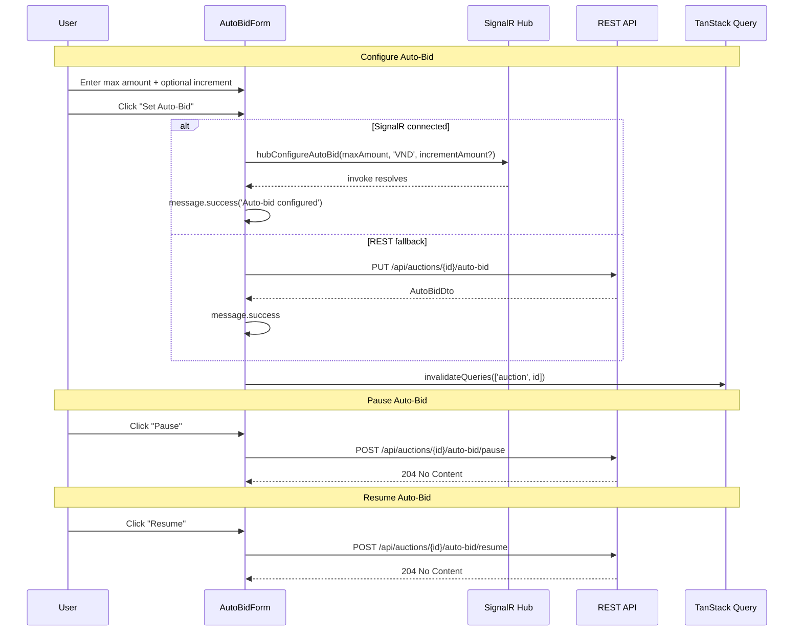

# 03 -- Auto-Bid (Frontend)

> **Status**: Implemented
> **Component**: `AutoBidForm`
> **Service**: `auctionService.configureAutoBid()`, `pauseAutoBid()`, `resumeAutoBid()`
> **Hooks**: `useBidding.useConfigureAutoBid()`, `usePauseAutoBid()`, `useResumeAutoBid()`

## Overview

Auto-bid (proxy bidding) allows a bidder to set a maximum budget and optional custom increment. The system automatically places the minimum winning bid on their behalf whenever they are outbid, up to the maximum amount. Only available in open (non-sealed) auctions.

## User Flow



## Component: AutoBidForm

**File**: `src/components/auction/AutoBidForm.tsx`

### Props

```typescript
interface AutoBidFormProps {
  auction: Auction;
  hubConfigureAutoBid?: (
    maxAmount: number,
    currency: string,
    incrementAmount?: number,
  ) => Promise<void>;
}
```

### Layout

The component renders in a `Collapse` panel (ghost style, small size) with two sections:

1. **Existing auto-bid status** (shown if `auction.currentUserAutoBid` exists):
   - Status tag (color-coded by auto-bid status)
   - Current max amount
   - Total auto-bids placed
   - Increment amount (if set)
   - Pause/Resume buttons

2. **Configuration form** (always available inside collapsible):
   - Max amount input (`InputNumber<number>` with VND formatter)
   - Increment amount input (optional, min = `auction.bidIncrement`)
   - Info alert explaining how auto-bid works
   - Submit button ("Set Auto-Bid" or "Update Auto-Bid")

### Status Tag Colors

```typescript
const STATUS_TAG_COLOR: Record<AutoBidStatus, string> = {
  active: 'green',
  paused: 'orange',
  exhausted: 'red',
  won: 'blue',
  outbid: 'volcano',
};
```

### Validation

- `maxAmount` must be >= `auction.minimumBidAmount`
- `incrementAmount` (optional) must be >= `auction.bidIncrement`

### Pause/Resume

| Status | Available Action | Button |
|--------|-----------------|--------|
| `active` | Pause | `PauseCircleOutlined` icon |
| `paused` | Resume | `PlayCircleOutlined` icon |
| `exhausted` | Update (increase max) | Form submit |
| `outbid` | Update (increase max) | Form submit |
| `won` | None (terminal) | No controls shown |

Pause/resume use REST endpoints only (no SignalR methods for these).

## API Calls

| Method | URL | Request Body | Response |
|--------|-----|-------------|----------|
| `PUT` | `/api/auctions/{id}/auto-bid` | `{ maxAmount, currency: "VND", incrementAmount? }` | `AutoBidDto` |
| `POST` | `/api/auctions/{id}/auto-bid/pause` | (none) | `204 No Content` |
| `POST` | `/api/auctions/{id}/auto-bid/resume` | (none) | `204 No Content` |
| `GET` | `/api/auctions/{id}/auto-bid/my` | (none) | `AutoBidDto` or 404 |

### Service Functions

**File**: `src/services/auctionService.ts`

- `configureAutoBid(auctionId, maxAmount, incrementAmount?)` -- PUT request
- `pauseAutoBid(auctionId)` -- POST request
- `resumeAutoBid(auctionId)` -- POST request
- `getMyAutoBid(auctionId)` -- GET request (returns `null` on 404)

## Hooks

**File**: `src/hooks/useBidding.ts`

### useConfigureAutoBid

```typescript
export function useConfigureAutoBid() {
  const queryClient = useQueryClient();
  return useMutation({
    mutationFn: ({ auctionId, maxAmount, incrementAmount }) =>
      configureAutoBid(auctionId, maxAmount, incrementAmount),
    onSuccess: (_data, { auctionId }) => {
      queryClient.invalidateQueries({ queryKey: ['auction', auctionId] });
    },
  });
}
```

### usePauseAutoBid / useResumeAutoBid

Both follow the same pattern: call the respective service function and invalidate `['auction', auctionId]` on success.

## SignalR Action

The `ConfigureAutoBid` SignalR method is the primary channel when connected:

```typescript
// From auctionHubService.ts
async function configureAutoBid(
  auctionId: string,
  maxAmount: number,
  currency: string,
  incrementAmount?: number
): Promise<void> {
  const conn = getOrCreateConnection();
  await conn.invoke('ConfigureAutoBid', auctionId, maxAmount, currency, incrementAmount ?? null);
}
```

Errors from `ConfigureAutoBid` are sent via the `Error` event to `Clients.Caller` (not as a return value).

## FE AutoBid Type

**File**: `src/types/auction.ts`

```typescript
export interface AutoBid {
  id: string;
  auctionId: string;
  userId: string;
  isEnabled: boolean;
  maxAmount: number;
  currentAmount: number;
  incrementAmount: number | null;
  status: AutoBidStatus;
  totalAutoBids: number;
  lastAutoBidAt: string | null;
  createdAt: string;
  modifiedAt: string;
}
```

Note: The FE `AutoBid` type uses flat `number` fields for amounts, while the BE `AutoBidDto` wraps amounts in `MoneyDto` objects. The adapter is not yet implemented -- the service currently passes the BE response directly. This means `maxAmount` on the FE may actually be a `MoneyDto` object at runtime when fetched from `getMyAutoBid()`.

## Known Limitations

- **No adapter for AutoBidDto**: BE returns `MoneyDto` wrapped amounts but FE type expects flat numbers. The `configureAutoBid()` service returns the raw BE response. The `auction.currentUserAutoBid` field is always `null` in practice (not populated by `GET /api/auctions/{id}`).
- **Pause/Resume via REST only**: There are no SignalR hub methods for pause/resume -- these always use REST endpoints.
- **Wallet hold is invisible**: The BE holds funds in the wallet when configuring auto-bid, but the FE does not display the hold amount or warn about insufficient wallet balance.

## Source Files

| File | Path |
|------|------|
| Component | `src/components/auction/AutoBidForm.tsx` |
| Service functions | `src/services/auctionService.ts` -- `configureAutoBid()`, `pauseAutoBid()`, `resumeAutoBid()`, `getMyAutoBid()` |
| Mutation hooks | `src/hooks/useBidding.ts` -- `useConfigureAutoBid()`, `usePauseAutoBid()`, `useResumeAutoBid()` |
| SignalR action | `src/services/auctionHubService.ts` -- `configureAutoBid()` |
| AutoBid type | `src/types/auction.ts` -- `AutoBid` |
| AutoBidStatus enum | `src/types/enums.ts` -- `AutoBidStatus` |
