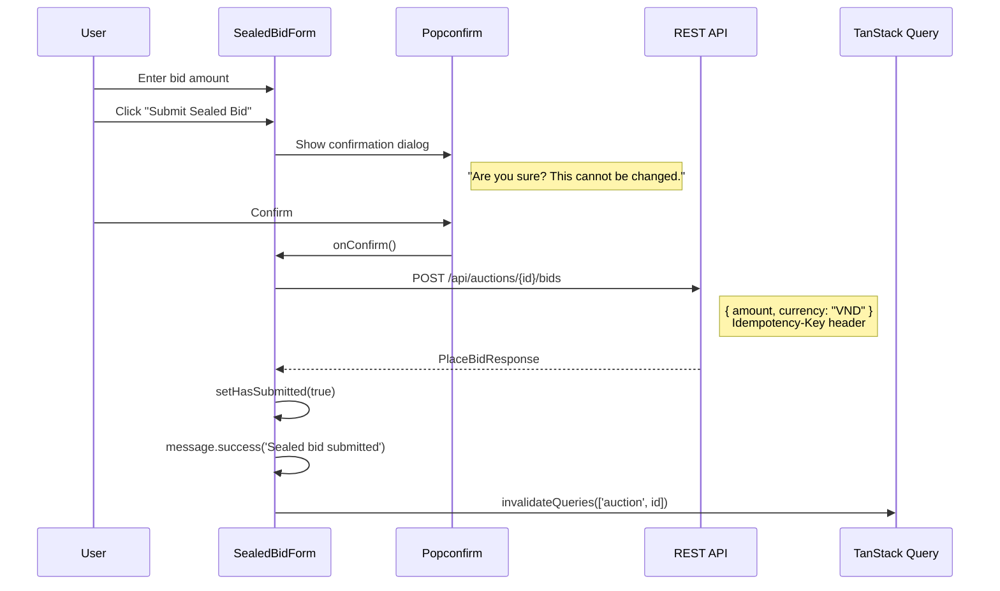

# 04 -- Sealed Bid (Frontend)

> **Status**: Implemented
> **Component**: `SealedBidForm`
> **Service**: `auctionService.submitSealedBid()`
> **Hook**: `useBidding.useSubmitSealedBid()`

## Overview

Sealed-bid auctions use a different model from open auctions. Each bidder submits exactly ONE bid (irreversible), and all bids are hidden until the auction ends. The FE component handles submission with a `Popconfirm` since sealed bids cannot be changed or withdrawn.

## User Flow



## Component: SealedBidForm

**File**: `src/components/auction/SealedBidForm.tsx`

### Props

```typescript
interface SealedBidFormProps {
  auction: Auction;
}
```

### Three States

| State | Condition | Display |
|-------|-----------|---------|
| **Not qualified** | `auction.currentUserDeposit === null` | Warning alert: "Not qualified" |
| **Already submitted** | `hasSubmitted === true` (local state) | `Result` with green checkmark + "Waiting for reveal" |
| **Ready to submit** | Qualified + not submitted | Bid form with Popconfirm |

### Form Layout

1. **Warning alert**: Explains the one-bid rule (sealed bid is irreversible)
2. **Amount input**: `InputNumber<number>` with VND formatter, min = `auction.startingPrice`
3. **Submit button**: Wrapped in `Popconfirm` for two-step confirmation

### Validation

- Amount must be >= `auction.startingPrice` (client-side)
- Step size = `auction.bidIncrement` (for up/down arrows)

### Post-Submission Display

After successful submission, the form is replaced with an Ant Design `Result` component:
- Green checkmark icon (`CheckCircleOutlined`)
- Title: "Sealed bid submitted" (i18n key: `bidding.sealedBidSubmitted`)
- Subtitle: "Waiting for auction to end" (i18n key: `bidding.sealedBidWaiting`)

## API Call

| Method | URL | Headers | Request Body | Response |
|--------|-----|---------|-------------|----------|
| `POST` | `/api/auctions/{auctionId}/bids` | `Idempotency-Key: <UUID>` | `{ amount, currency: "VND" }` | `PlaceBidResponse` |

**Important**: The FE currently uses the same endpoint as manual bids (`/api/auctions/{id}/bids`). The BE should differentiate based on auction type. The correct BE endpoint for sealed bids is `POST /api/auctions/{id}/sealed-bids`, but the FE service function `submitSealedBid()` has not been updated to use it.

### Service Function

**File**: `src/services/auctionService.ts`

```typescript
export async function submitSealedBid(
  auctionId: string,
  amount: number
): Promise<PlaceBidResponse> {
  const { data } = await api.post<PlaceBidResponse>(
    `/api/auctions/${auctionId}/bids`,  // Should be /sealed-bids
    { amount, currency: 'VND' },
    { headers: { 'Idempotency-Key': crypto.randomUUID() } },
  );
  return data;
}
```

## Hook: useSubmitSealedBid

**File**: `src/hooks/useBidding.ts`

```typescript
export function useSubmitSealedBid() {
  const queryClient = useQueryClient();
  return useMutation({
    mutationFn: ({ auctionId, amount }) => submitSealedBid(auctionId, amount),
    onSuccess: (_data, { auctionId }) => {
      queryClient.invalidateQueries({ queryKey: ['auction', auctionId] });
      queryClient.invalidateQueries({ queryKey: ['myBids'] });
    },
  });
}
```

## BidHistoryList: Sealed Auction Behavior

When `auctionType === 'sealed'` and the auction is active, `BidHistoryList` hides all bids:

```tsx
if (auctionType === 'sealed' && isActive) {
  return (
    <Flex align="center" justify="center" gap={8}>
      <LockOutlined />
      <Text type="secondary">{t('auctionDetail.sealedBidsHidden')}</Text>
    </Flex>
  );
}
```

After the auction ends, bids become visible (revealed by BE).

## BiddingPanel: Sealed Auction Routing

In `BiddingPanel`, auction type determines which form is shown:

```tsx
{/* ACTIVE OPEN + QUALIFIED -> BidForm + AutoBidForm */}
{isActive && !isSealed && isQualified && (
  <BidForm auction={auction} hubPlaceBid={hubPlaceBid} />
)}

{/* ACTIVE SEALED -> SealedBidForm */}
{isActive && isSealed && <SealedBidForm auction={auction} />}
```

Sealed detection: `const isSealed = auction.auctionType === 'sealed'`

## Known Limitations

- **Wrong endpoint**: `submitSealedBid()` calls `/api/auctions/{id}/bids` instead of `/api/auctions/{id}/sealed-bids`. Needs to be updated when sealed auctions are tested end-to-end.
- **No "already submitted" persistence**: The `hasSubmitted` state is local (`useState`). If the user refreshes the page, they lose the submitted state and see the form again. A proper implementation would check the BE for an existing sealed bid on mount.
- **No BE encryption**: The BE encrypts the amount server-side via `ISealedBidEncryptionService.Encrypt()`, but the FE sends the amount in plaintext -- the encryption happens at the BE endpoint layer, not in the FE.
- **No SignalR**: Sealed bid submission uses REST only (no `PlaceBid` via SignalR for sealed auctions -- the BE rejects live bids on sealed auctions with `Bid.SealedAuctionOnly`).

## Source Files

| File | Path |
|------|------|
| Component | `src/components/auction/SealedBidForm.tsx` |
| Service function | `src/services/auctionService.ts` -- `submitSealedBid()` |
| Mutation hook | `src/hooks/useBidding.ts` -- `useSubmitSealedBid()` |
| Bid history (sealed mode) | `src/components/auction/BidHistoryList.tsx` |
| AuctionType enum | `src/types/enums.ts` -- `AuctionType` |
