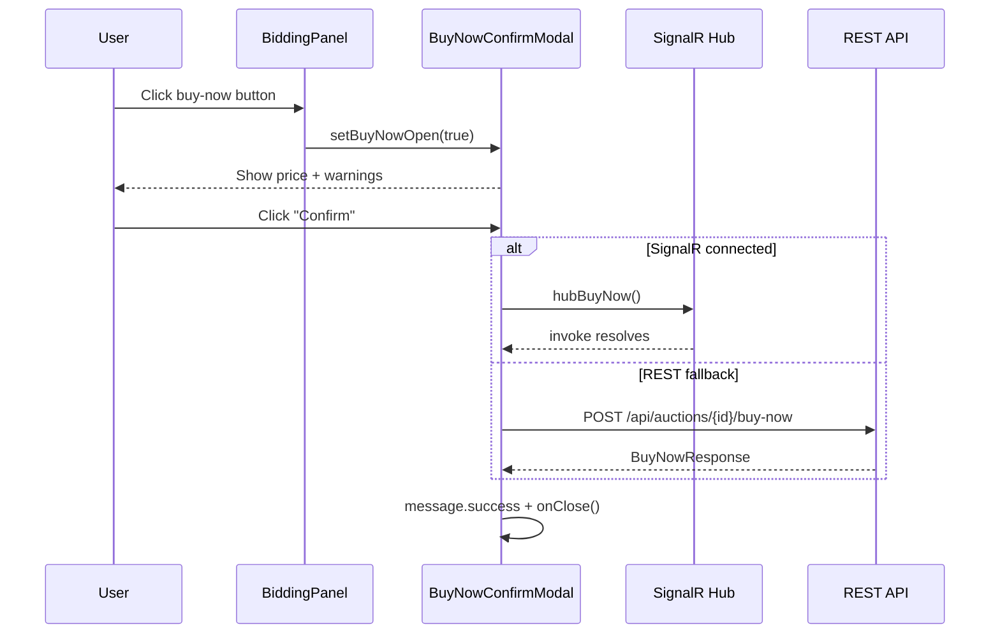

# 05 -- Buy Now (Frontend)

> **Status**: Partial (UI implemented, VNPay redirect not wired)
> **Component**: `BuyNowConfirmModal`
> **Service**: `auctionService.buyNow()`
> **Hook**: `useBidding.useBuyNow()`

## Overview

Buy-now allows a qualified bidder to purchase an auction item immediately at the `buyNowPrice`, ending the auction. The FE implements a confirmation modal and supports both SignalR and REST channels. However, the full VNPay redirect flow (reservation -> payment URL -> redirect -> callback) is not yet wired -- the current implementation calls the endpoint but does not handle the `BuyNowCheckoutDto` response properly.

## User Flow (Current Implementation)



### What Should Happen (Full Flow)

The BE `POST /api/auctions/{id}/buy-now` returns a `BuyNowCheckoutDto` containing:
- `reservationId` -- 15-minute reservation
- `paymentUrl` -- VNPay redirect URL
- `expiresAt` -- when reservation expires
- `buyNowPrice`, `depositAppliedAmount`, `amountDue` -- pricing breakdown

The FE should redirect the user to `paymentUrl` (similar to deposit flow). This is NOT yet implemented.

## Component: BuyNowConfirmModal

**File**: `src/components/auction/BuyNowConfirmModal.tsx`

### Props

```typescript
interface BuyNowConfirmModalProps {
  open: boolean;
  onClose: () => void;
  auction: Auction;
  hubBuyNow?: () => Promise<void>;
}
```

### Display

1. **Price display**: Buy-now price in large orange text (28px, `#fa8c16`)
2. **Warning alert**: "Auction ends immediately" (`bidding.buyNowWarning`)
3. **Info alert**: "Simulated feature" note (`bidding.buyNowNote`)

Responsive: full-width on mobile, 480px on desktop.

### Dual Channel Support

```typescript
const handleConfirm = async () => {
  if (hubBuyNow) {
    // SignalR primary path
    await hubBuyNow();
    message.success(t('bidding.buyNowSuccess'));
    onClose();
  } else {
    // REST fallback
    buyNow.mutate(auction.id, { onSuccess: ... });
  }
};
```

## BiddingPanel Integration

The buy-now button appears in `BiddingPanel` when:
- Auction is active AND not sealed
- User is qualified
- `auction.buyNowPrice` is set

```tsx
{auction.buyNowPrice && isQualified && (
  <Button
    size="large"
    block
    icon={<ShoppingCartOutlined />}
    onClick={() => setBuyNowOpen(true)}
    style={{ color: '#fa8c16', borderColor: '#fa8c16' }}
  >
    {t('bidding.buyNowButton')} -- {formatVND(auction.buyNowPrice)}
  </Button>
)}
```

## API Call

| Method | URL | Request Body | Response |
|--------|-----|-------------|----------|
| `POST` | `/api/auctions/{auctionId}/buy-now` | (none) | `BuyNowResponse` |

### FE Response Type (Current)

```typescript
export interface BuyNowResponse {
  orderId: string;
  finalPrice: number;
}
```

### BE Response Type (Actual)

The BE actually returns `BuyNowCheckoutDto`:
```
{
  reservationId: string,
  paymentUrl: string,
  expiresAt: string,
  buyNowPrice: MoneyDto,
  depositAppliedAmount: MoneyDto,
  amountDue: MoneyDto
}
```

The FE type does not match the BE response -- this needs to be updated.

## Hook: useBuyNow

**File**: `src/hooks/useBidding.ts`

```typescript
export function useBuyNow() {
  const queryClient = useQueryClient();
  return useMutation({
    mutationFn: (auctionId: string) => buyNow(auctionId),
    onSuccess: (_data, auctionId) => {
      queryClient.invalidateQueries({ queryKey: ['auction', auctionId] });
      queryClient.invalidateQueries({ queryKey: ['wallet', 'me'] });
      queryClient.invalidateQueries({ queryKey: ['myBids'] });
    },
  });
}
```

## SignalR Events

| Event | Handler in AuctionDetailPage |
|-------|------------------------------|
| `BuyNowExecuted` | Invalidate `['auction', id]` |

The `BuyNowReserved` and `BuyNowReservationReleased` events from BE are NOT currently handled in the FE.

## What's Missing (Not Wired)

| Feature | Status | Notes |
|---------|--------|-------|
| VNPay redirect after buy-now | Not implemented | Should redirect to `paymentUrl` from `BuyNowCheckoutDto` |
| `BuyNowCheckoutDto` parsing | Not implemented | FE type `BuyNowResponse` doesn't match BE response |
| Reservation timer display | Not implemented | Should show 15-minute countdown |
| Deposit auto-apply display | Not implemented | BE applies held deposit, FE doesn't show this |
| `BuyNowReserved` event handling | Not implemented | Should notify other bidders that auction is locked |
| `BuyNowReservationReleased` event | Not implemented | Should notify bidders that auction is unlocked |
| Auction lock indicator | Not implemented | Other bidders should see "Buy-now in progress" |

## Source Files

| File | Path |
|------|------|
| Component | `src/components/auction/BuyNowConfirmModal.tsx` |
| Service function | `src/services/auctionService.ts` -- `buyNow()` |
| Mutation hook | `src/hooks/useBidding.ts` -- `useBuyNow()` |
| SignalR action | `src/services/auctionHubService.ts` -- `buyNow()` |
| Response type (FE) | `src/types/auction.ts` -- `BuyNowResponse` |
| SignalR event type | `src/types/signalr.ts` -- `BuyNowNotification` |
