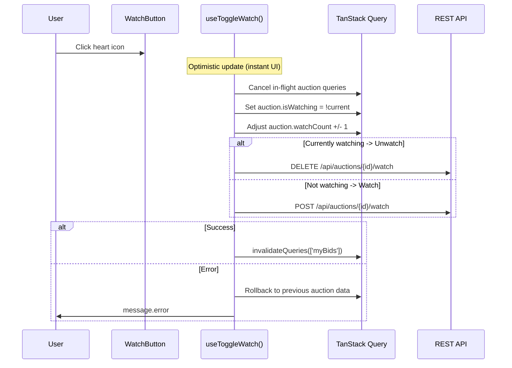

# 06 -- Watch Auction (Frontend)

> **Status**: Implemented
> **Components**: `WatchButton`, `WatchingList` (in MyBidsPage)
> **Service**: `auctionService.toggleWatch()`, `myBidsService.getMyWatchlist()`
> **Hooks**: `useBidding.useToggleWatch()`, `useMyBids.useMyWatchedAuctions()`, `useMyBids.useIsWatching()`

## Overview

Users can watch auctions to track them from the My Bids page. The WatchButton component shows a heart icon and toggles watch/unwatch. The implementation uses optimistic UI updates because the BE does not return `isWatching` in the auction detail response.

## User Flow



## Component: WatchButton

**File**: `src/components/auction/WatchButton.tsx`

### Props

```typescript
interface WatchButtonProps {
  auctionId: string;
  isWatching: boolean;
  watchCount: number;
}
```

### Display

- **Watching**: Filled red heart (`HeartFilled`, color `#ff4d4f`) + "Watching" text
- **Not watching**: Outlined heart (`HeartOutlined`) + "Watch" text
- **Watch count**: Shown in parentheses if > 0

### Usage in BiddingPanel

```tsx
<WatchButton
  auctionId={auction.id}
  isWatching={isWatchingFromList || auction.isWatching}
  watchCount={auction.watchCount}
/>
```

The `isWatching` prop is derived from two sources:
1. `useIsWatching(auction.id)` -- cross-references the cached watchlist
2. `auction.isWatching` -- from auction data (always `false` since BE doesn't return it)

## Determining Watch State

**File**: `src/hooks/useMyBids.ts`

Since the BE `GET /api/auctions/{id}` does not include `isWatching`, the FE cross-references with the watchlist cache:

```typescript
export function useIsWatching(auctionId: string | undefined): boolean {
  const { data: watchlist } = useMyWatchedAuctions();
  if (!auctionId || !watchlist) return false;
  return watchlist.some((item) => item.id === auctionId);
}
```

This hook reads from the cached watchlist query (`['myBids', 'watching']`), which polls every 30 seconds.

## API Calls

| Method | URL | Request Body | Response |
|--------|-----|-------------|----------|
| `POST` | `/api/auctions/{id}/watch` | (none -- defaults `notifyOnBid: true, notifyOnEnd: true`) | `ToggleWatchResponse` |
| `DELETE` | `/api/auctions/{id}/watch` | (none) | `204 No Content` |
| `GET` | `/api/me/auctions/watch-list` | Query: `PageNumber=1, PageSize=50` | Paginated list of watched auctions |

### Service Functions

**File**: `src/services/auctionService.ts`

```typescript
export async function toggleWatch(
  auctionId: string,
  currentlyWatching: boolean,
): Promise<ToggleWatchResponse> {
  if (currentlyWatching) {
    await api.delete(`/api/auctions/${auctionId}/watch`);
    return { isWatching: false, newWatchCount: -1 };
  }
  const { data } = await api.post<ToggleWatchResponse>(
    `/api/auctions/${auctionId}/watch`,
  );
  return data;
}
```

Note: The `POST` body does not send `notifyOnBid`/`notifyOnEnd` -- the BE defaults both to `true`.

## Hook: useToggleWatch (Optimistic Updates)

**File**: `src/hooks/useBidding.ts`

This hook uses TanStack Query's optimistic update pattern:

```typescript
export function useToggleWatch() {
  const queryClient = useQueryClient();
  return useMutation({
    mutationFn: ({ auctionId, currentlyWatching }) =>
      toggleWatch(auctionId, currentlyWatching),
    onMutate: async ({ auctionId, currentlyWatching }) => {
      await queryClient.cancelQueries({ queryKey: ['auction', auctionId] });
      const previous = queryClient.getQueryData<Auction>(['auction', auctionId]);
      if (previous) {
        queryClient.setQueryData<Auction>(['auction', auctionId], {
          ...previous,
          isWatching: !currentlyWatching,
          watchCount: previous.watchCount + (currentlyWatching ? -1 : 1),
        });
      }
      return { previous };
    },
    onError: (_err, { auctionId }, context) => {
      if (context?.previous) {
        queryClient.setQueryData(['auction', auctionId], context.previous);
      }
    },
    onSuccess: () => {
      queryClient.invalidateQueries({ queryKey: ['myBids'] });
    },
  });
}
```

**Why optimistic updates?** The BE does not return `isWatching` in `GET /api/auctions/{id}`, so a refetch would reset `isWatching` to `false`. Without optimistic updates, clicking watch -> refetch -> UI shows unwatched -> user clicks again -> 409 Conflict.

## Watchlist on MyBidsPage

The "Watching" tab on MyBidsPage uses `useMyWatchedAuctions()`:

```typescript
export function useMyWatchedAuctions() {
  return useQuery({
    queryKey: ['myBids', 'watching'],
    queryFn: getMyWatchlist,
    refetchInterval: 30_000,  // Poll every 30s
  });
}
```

**Data source**: `GET /api/me/auctions/watch-list`

The response items are mapped to `AuctionListItem` via `mapWatchlistItem()` adapter in `myBidsService.ts`. Notable BE inconsistency: `currentPrice` is a plain number (not wrapped in `MoneyDto`).

## SignalR Watch Action

`WatchAuction` is also available via SignalR (but not used by `WatchButton`):

```typescript
// auctionHubService.ts
async function watchAuction(
  auctionId: string,
  notifyOnBid = true,
  notifyOnEnd = true
): Promise<void> {
  const conn = getOrCreateConnection();
  await conn.invoke('WatchAuction', auctionId, notifyOnBid, notifyOnEnd);
}
```

The `useAuctionHub` hook exposes this as `watchAuction()`, but it's not currently used by any component.

## Source Files

| File | Path |
|------|------|
| WatchButton component | `src/components/auction/WatchButton.tsx` |
| WatchingList component | `src/components/mybids/WatchingList.tsx` |
| Toggle watch service | `src/services/auctionService.ts` -- `toggleWatch()` |
| Watchlist service | `src/services/myBidsService.ts` -- `getMyWatchlist()` |
| Toggle watch hook | `src/hooks/useBidding.ts` -- `useToggleWatch()` |
| Watchlist hook | `src/hooks/useMyBids.ts` -- `useMyWatchedAuctions()` |
| isWatching hook | `src/hooks/useMyBids.ts` -- `useIsWatching()` |
| SignalR action | `src/services/auctionHubService.ts` -- `watchAuction()` |
| AuctionWatcher type | `src/types/auction.ts` -- `AuctionWatcher` |
