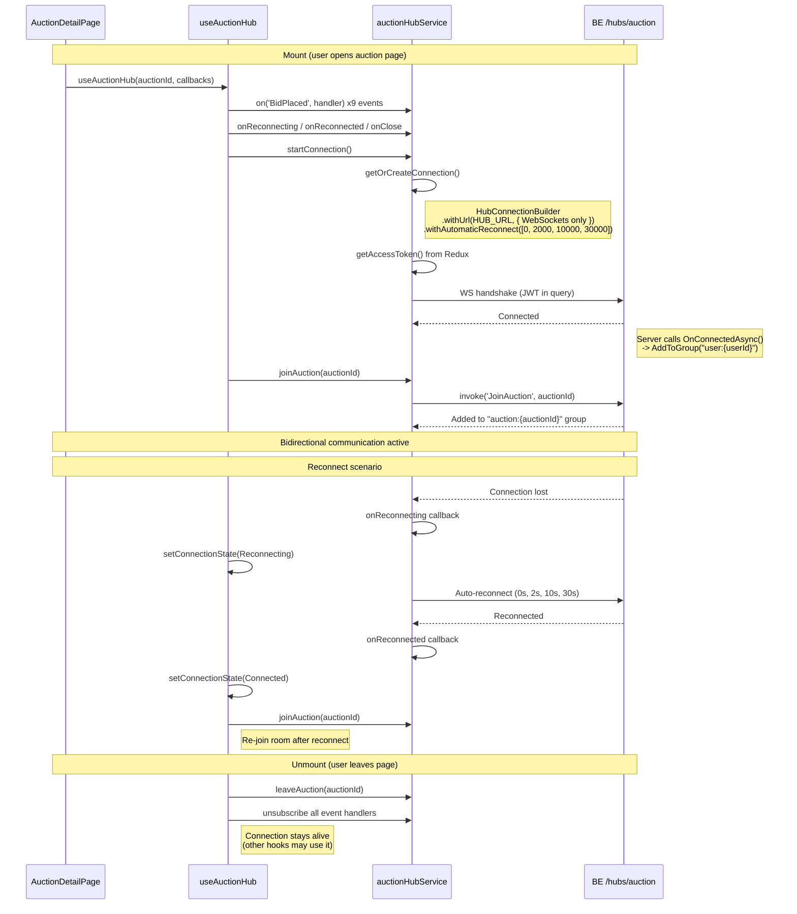

# 07 -- SignalR Auction Hub (Frontend)

> **Status**: Implemented
> **Service**: `auctionHubService.ts` (singleton connection manager)
> **Hook**: `useAuctionHub.ts` (React lifecycle wrapper)
> **Types**: `signalr.ts` (notification interfaces)

## Overview

The SignalR auction hub is the primary real-time communication channel for bidding. The FE maintains a singleton `HubConnection` to `/hubs/auction` and provides type-safe wrappers for all client-to-server and server-to-client interactions. The `useAuctionHub` hook manages connection lifecycle per auction room.

## Architecture

```mermaid
graph TD
    subgraph React Components
        ADP[AuctionDetailPage]
        BP[BiddingPanel]
        BF[BidForm]
        ABF[AutoBidForm]
        BNM[BuyNowConfirmModal]
    end

    subgraph Hook Layer
        UAH[useAuctionHub]
    end

    subgraph Service Layer
        AHS[auctionHubService<br/>singleton]
    end

    subgraph SignalR
        HC[HubConnection<br/>@microsoft/signalr]
        BE[BE AuctionHub<br/>/hubs/auction]
    end

    ADP -->|auctionId + callbacks| UAH
    UAH -->|connect, join, events| AHS
    AHS -->|WebSocket| HC
    HC -->|WS frames| BE

    UAH -->|placeBid, buyNow,<br/>configureAutoBid| BP
    BP --> BF
    BP --> ABF
    BP --> BNM
```

## Connection Lifecycle



## Hub Configuration

| Property | Value | Source |
|----------|-------|--------|
| Hub URL | `${VITE_API_BASE_URL}/hubs/auction` | `auctionHubService.ts` |
| Transport | WebSockets only (`HttpTransportType.WebSockets`) | Avoids proxy routing issues |
| Skip negotiation | `true` | Prevents connectionId mismatch with Cloudflare/Caddy |
| Credentials | `withCredentials: false` | Uses Authorization header, not cookies |
| Auto-reconnect | `[0, 2000, 10000, 30000]` ms | Increasing delays |
| Log level | `Information` (dev) / `Warning` (prod) | Environment-dependent |
| Auth | JWT Bearer token from Redux `state.auth.accessToken` | Refreshed on each connect/reconnect |
| Singleton | One `HubConnection` per app | `getOrCreateConnection()` pattern |

### Start Promise Deduplication

The service tracks the in-flight `start()` promise to prevent race conditions:

```typescript
let startPromise: Promise<void> | null = null;

async function startConnection(): Promise<void> {
  if (conn.state === HubConnectionState.Connected) return;
  if (startPromise) return startPromise;  // Wait for existing attempt
  if (!getAccessToken()) return;           // Skip without auth

  startPromise = conn.start().finally(() => { startPromise = null; });
  return startPromise;
}
```

## Client-to-Server Methods (6)

| # | Method | FE Function | Parameters | Used By |
|---|--------|-------------|-----------|---------|
| 1 | `JoinAuction` | `joinAuction(auctionId)` | `auctionId: string` | `useAuctionHub` (on mount + reconnect) |
| 2 | `LeaveAuction` | `leaveAuction(auctionId)` | `auctionId: string` | `useAuctionHub` (on unmount) |
| 3 | `PlaceBid` | `placeBid(auctionId, amount, currency)` | `auctionId, amount, currency` | `BidForm` (via `hubPlaceBid` prop) |
| 4 | `BuyNow` | `buyNow(auctionId)` | `auctionId` | `BuyNowConfirmModal` (via `hubBuyNow` prop) |
| 5 | `ConfigureAutoBid` | `configureAutoBid(auctionId, maxAmount, currency, incrementAmount?)` | `auctionId, maxAmount, currency, incrementAmount \| null` | `AutoBidForm` (via `hubConfigureAutoBid` prop) |
| 6 | `WatchAuction` | `watchAuction(auctionId, notifyOnBid?, notifyOnEnd?)` | `auctionId, notifyOnBid, notifyOnEnd` | Not currently used by any component |

All methods use `conn.invoke()` which sends the request and waits for the server to acknowledge.

## Server-to-Client Events (9)

### Event Registration

Events are registered BEFORE connecting to avoid missing events that fire immediately after join:

```typescript
// In useAuctionHub setup()
unsubscribers.push(
  auctionHubService.on('BidPlaced', (data) => callbacksRef.current?.onBidPlaced?.(data)),
  auctionHubService.on('Outbid', (data) => callbacksRef.current?.onOutbid?.(data)),
  // ... 7 more events
);
```

### Event Details

| # | Event | FE Type | Sent To | Handler in AuctionDetailPage |
|---|-------|---------|---------|------------------------------|
| 1 | `BidPlaced` | `BidNotification` | Auction group | Invalidate auction + bids queries. Success toast if `bidderId === userId`. |
| 2 | `Outbid` | `OutbidNotification` | User group (personal) | Warning toast with new high amount |
| 3 | `BuyNowExecuted` | `BuyNowNotification` | Auction group | Invalidate auction query |
| 4 | `AuctionStarted` | `AuctionStartedNotification` | Auction group | (not handled) |
| 5 | `AuctionEnded` | `AuctionEndedNotification` | Auction group | Info toast + invalidate auction query |
| 6 | `AuctionExtended` | `AuctionExtendedNotification` | Auction group | Info toast with extension minutes + invalidate |
| 7 | `AuctionCancelled` | `AuctionCancelledNotification` | Auction group | Invalidate auction query |
| 8 | `PriceUpdated` | `PriceUpdateNotification` | Auction group | Invalidate auction query |
| 9 | `Error` | `HubErrorNotification` | Caller only | Set `window.__bidError = true` + error toast |

### Event Payload Types

**File**: `src/types/signalr.ts`

```typescript
// BidPlaced
interface BidNotification {
  auctionId: string;
  bidId: string;
  bidderId: string;
  bidderDisplayName: string;
  amount: number;
  currentPrice: number;
  minimumNextBid: number;
  totalBids: number;
  isAutoBid: boolean;
  timestamp: string;     // ISO 8601
}

// Outbid (personal)
interface OutbidNotification {
  auctionId: string;
  newHighAmount: number;
  minimumNextBid: number;
  newHighBidderDisplayName: string;
}

// PriceUpdated (periodic sync)
interface PriceUpdateNotification {
  auctionId: string;
  currentPrice: number;
  minimumNextBid: number;
  totalBids: number;
  remainingTime: string;  // TimeSpan as "hh:mm:ss" or "d.hh:mm:ss"
}

// Error (caller only)
interface HubErrorNotification {
  code: string;
  message: string;
  errors: Record<string, string[]> | null;  // Validation errors by field
}
```

### Events NOT Handled by FE

| BE Event | Why Not Handled |
|----------|-----------------|
| `BuyNowReserved` | Buy-now reservation flow not fully wired |
| `BuyNowReservationReleased` | Buy-now reservation flow not fully wired |
| `AuctionStarted` | Callback registered but no handler in `AuctionDetailPage` |

## Type-Safe Event System

The hub event map (`AuctionHubEvents`) enables type-safe `on()`/`off()` calls:

```typescript
// src/types/signalr.ts
export interface AuctionHubEvents {
  BidPlaced: BidNotification;
  Outbid: OutbidNotification;
  BuyNowExecuted: BuyNowNotification;
  AuctionStarted: AuctionStartedNotification;
  AuctionEnded: AuctionEndedNotification;
  AuctionExtended: AuctionExtendedNotification;
  AuctionCancelled: AuctionCancelledNotification;
  PriceUpdated: PriceUpdateNotification;
  Error: HubErrorNotification;
}

// src/services/auctionHubService.ts
function on<K extends keyof AuctionHubEvents>(
  event: K,
  handler: (data: AuctionHubEvents[K]) => void
): () => void {
  const conn = getOrCreateConnection();
  conn.on(event, handler);
  return () => conn.off(event, handler);
}
```

## Group Management

| Group Pattern | Scope | Join | Leave |
|---------------|-------|------|-------|
| `auction:{auctionId}` | Broadcast to all viewers | `JoinAuction` (explicit) | `LeaveAuction` (explicit, on unmount) |
| `user:{userId}` | Personal notifications | Auto on `OnConnectedAsync` | Auto on `OnDisconnectedAsync` |

## Hook: useAuctionHub

**File**: `src/hooks/useAuctionHub.ts`

### Parameters

```typescript
function useAuctionHub(
  auctionId: string | undefined,  // undefined = don't connect
  callbacks?: AuctionHubCallbacks
)
```

### Return Value

```typescript
{
  connectionState: HubConnectionState;
  isConnected: boolean;
  placeBid: (amount: number, currency: string) => Promise<void>;
  buyNow: () => Promise<void>;
  configureAutoBid: (maxAmount: number, currency: string, incrementAmount?: number) => Promise<void>;
  watchAuction: (notifyOnBid?: boolean, notifyOnEnd?: boolean) => Promise<void>;
}
```

### Callback Ref Pattern

Callbacks are stored in a `useRef` so event handlers always call the latest version without needing to re-subscribe:

```typescript
const callbacksRef = useRef(callbacks);
callbacksRef.current = callbacks;

// Event handlers read from ref:
auctionHubService.on('BidPlaced', (data) =>
  callbacksRef.current?.onBidPlaced?.(data)
);
```

### Usage in AuctionDetailPage

```typescript
const { isConnected, placeBid, buyNow, configureAutoBid } = useAuctionHub(
  isLoggedIn ? id : undefined,  // Only connect when logged in
  {
    onBidPlaced: (data) => { /* ... */ },
    onOutbid: (data) => { /* ... */ },
    onPriceUpdated: () => { /* ... */ },
    // ... more callbacks
  },
);
```

The actions are passed down as props to child components:
```tsx
<BiddingPanel
  hubPlaceBid={isConnected ? placeBid : undefined}
  hubBuyNow={isConnected ? buyNow : undefined}
  hubConfigureAutoBid={isConnected ? configureAutoBid : undefined}
  isConnected={isConnected}
/>
```

## Connection Status Indicator

`BiddingPanel` shows a connection dot when `isConnected` is defined:

```tsx
{isConnected !== undefined && (
  <Flex align="center" gap={6}>
    <div style={{
      width: 8, height: 8, borderRadius: '50%',
      backgroundColor: isConnected ? '#52c41a' : '#d9d9d9',
    }} />
    <Text type="secondary" style={{ fontSize: 12 }}>
      {isConnected ? t('bidding.liveConnection') : t('bidding.noConnection')}
    </Text>
  </Flex>
)}
```

## Known Issues

- **BidPlaced event not firing**: As of 2026-03-12, the BE `BidPlaced` SignalR event is not being received by FE clients (confirmed bug, reported to Tan). Success toast is handled optimistically in `BidForm` instead.
- **CORS for SignalR**: BE is missing `.AllowCredentials()` + VPS origin, which blocks SignalR when deployed. Workaround: `withCredentials: false` + `skipNegotiation: true` + WebSockets-only transport.
- **No `AuctionStarted` handler**: The event is subscribed but no callback is registered in `AuctionDetailPage`.

## Source Files

| File | Path |
|------|------|
| Hub service (singleton) | `src/services/auctionHubService.ts` |
| Hub React hook | `src/hooks/useAuctionHub.ts` |
| Event type definitions | `src/types/signalr.ts` |
| Hub event map | `src/types/signalr.ts` -- `AuctionHubEvents` |
| Page integration | `src/pages/public/AuctionDetailPage.tsx` |
