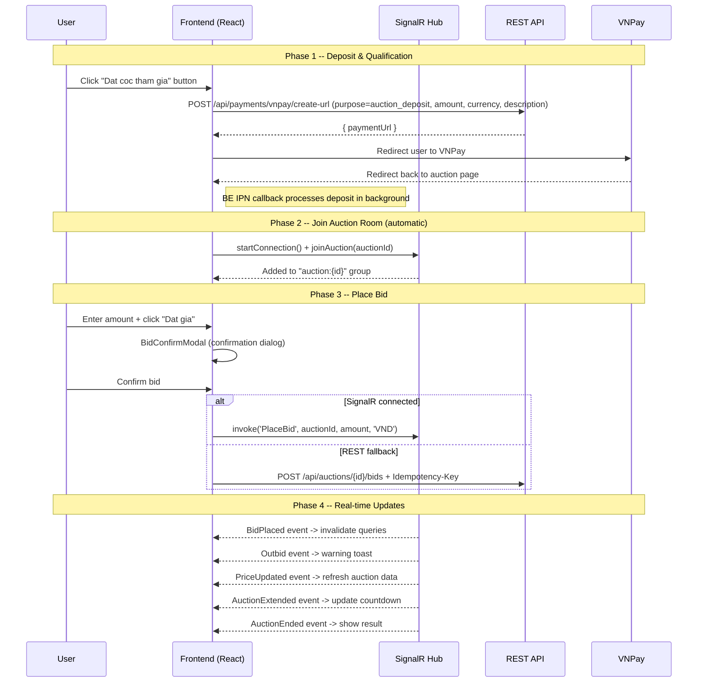

# Flow 07 -- Bidding (Frontend)

> **Status**: Implemented
> **Last verified**: 2026-03-21
> **BE docs**: `backend/docs/flows/07-bidding/`

## Overview

The bidding module is the core interactive system of the platform. It enables qualified bidders to place bids on active auctions in real-time via SignalR, with REST API as a fallback. The module covers the full bidding lifecycle: deposit/qualification, manual bids, auto-bids, sealed bids, buy-now, and auction watching.

## End-to-End Bidding Flow (User Perspective)



## Component Hierarchy

```
AuctionDetailPage
├── ImageGallery
├── BiddingPanel (orchestrator)
│   ├── WatchButton                    -- toggle watch/unwatch
│   ├── QualificationSection           -- deposit flow (VNPay redirect, visible during qual window OR active)
│   ├── BidForm                        -- manual bid input + quick-bid buttons
│   │   └── BidConfirmModal            -- confirmation before bid
│   ├── AutoBidForm                    -- configure auto-bid (collapsible)
│   ├── SealedBidForm                  -- one-time sealed bid (sealed auctions)
│   ├── BuyNowConfirmModal             -- buy-now confirmation
│   └── AuctionResult                  -- ended/sold/cancelled display
├── BidHistoryList                     -- scrollable bid feed
└── Seller info card

MyBidsPage
├── ActiveBidsList                     -- auctions with active/winning/outbid bids
├── EndedBidsList                      -- auctions with won/cancelled bids
└── WatchingList                       -- watched auctions (from watchlist endpoint)
```

## Routes

| Route | Page | Component |
|-------|------|-----------|
| `/auction/:id` | Auction detail + bidding | `AuctionDetailPage` |
| `/my-bids` | User's bid participation | `MyBidsPage` |

## API Endpoints Consumed

| # | Method | URL | FE Function | Purpose |
|---|--------|-----|-------------|---------|
| 1 | `POST` | `/api/payments/vnpay/create-url` | `createDepositUrl(auctionId, depositAmount)` | Get VNPay URL for deposit (sends purpose, amount, currency, description) |
| 2 | `POST` | `/api/auctions/{id}/bids` | `placeBid()` | Place manual bid (REST fallback) |
| 3 | `POST` | `/api/auctions/{id}/sealed-bids` | `submitSealedBid()` | Submit sealed bid |
| 4 | `POST` | `/api/auctions/{id}/buy-now` | `buyNow()` | Initiate buy-now purchase |
| 5 | `POST` | `/api/auctions/{id}/watch` | `toggleWatch()` | Watch an auction |
| 6 | `DELETE` | `/api/auctions/{id}/watch` | `toggleWatch()` | Unwatch an auction |
| 7 | `PUT` | `/api/auctions/{id}/auto-bid` | `configureAutoBid()` | Configure or update auto-bid |
| 8 | `POST` | `/api/auctions/{id}/auto-bid/pause` | `pauseAutoBid()` | Pause auto-bid |
| 9 | `POST` | `/api/auctions/{id}/auto-bid/resume` | `resumeAutoBid()` | Resume auto-bid |
| 10 | `GET` | `/api/auctions/{id}/auto-bid/my` | `getMyAutoBid()` | Get current user's auto-bid |
| 11 | `GET` | `/api/auctions/{id}/bids` | `getAuctionBids()` | Get bid history (paginated) |
| 12 | `GET` | `/api/auctions/{id}` | `getAuctionById()` | Get auction detail |
| 13 | `GET` | `/api/me/bids` | `getMyBids()` | Get user's bids (all, no filter) |
| 14 | `GET` | `/api/me/auctions/watch-list` | `getMyWatchlist()` | Get user's watched auctions |

## SignalR Hub

| Direction | Method/Event | Purpose |
|-----------|-------------|---------|
| **Client -> Server** | `JoinAuction(auctionId)` | Subscribe to auction events |
| **Client -> Server** | `LeaveAuction(auctionId)` | Unsubscribe from auction events |
| **Client -> Server** | `PlaceBid(auctionId, amount, currency)` | Place a bid (primary channel) |
| **Client -> Server** | `BuyNow(auctionId)` | Initiate buy-now |
| **Client -> Server** | `ConfigureAutoBid(auctionId, maxAmount, currency, incrementAmount?)` | Set up auto-bid |
| **Client -> Server** | `WatchAuction(auctionId, notifyOnBid?, notifyOnEnd?)` | Watch auction |
| **Server -> Client** | `BidPlaced` | New bid notification |
| **Server -> Client** | `Outbid` | User was outbid |
| **Server -> Client** | `PriceUpdated` | Price/time sync |
| **Server -> Client** | `AuctionExtended` | Anti-sniping extension |
| **Server -> Client** | `AuctionEnded` | Auction finished |
| **Server -> Client** | `AuctionCancelled` | Auction cancelled |
| **Server -> Client** | `BuyNowExecuted` | Buy-now completed |
| **Server -> Client** | `Error` | Caller-only error |

See [07-signalr-hub.md](./07-signalr-hub.md) for full details.

## State Management

### TanStack Query Keys

| Key | Source | Usage |
|-----|--------|-------|
| `['auction', auctionId]` | `getAuctionById()` | Auction detail data |
| `['auctionBids', auctionId]` | `getAuctionBids()` | Bid history list |
| `['myBids', 'all']` | `getMyBids()` | All user bids (polls every 30s) |
| `['myBids', 'watching']` | `getMyWatchlist()` | Watched auctions (polls every 30s) |
| `['wallet', 'me']` | `useWalletData()` | Wallet balance (shared with Wallet page) |

### SignalR Connection State

- Managed by `auctionHubService` (singleton pattern -- one connection per app)
- `useAuctionHub` hook tracks `HubConnectionState` (Connected, Disconnected, Reconnecting)
- Connection indicator shows a green/gray dot in BiddingPanel
- Auto-reconnect policy: `[0, 2000, 10000, 30000]` ms delays
- On reconnect: automatically re-joins the auction room

### Cache Invalidation Strategy

All SignalR events that change auction state trigger `queryClient.invalidateQueries()` for `['auction', id]` and `['auctionBids', id]`. This ensures TanStack Query refetches the latest data after real-time events arrive.

## Subflow Index

| File | Topic | Status |
|------|-------|--------|
| [01-deposit-qualification.md](./01-deposit-qualification.md) | VNPay deposit & qualification flow | Implemented |
| [02-manual-bid.md](./02-manual-bid.md) | Manual bid placement (BidForm + BidConfirmModal) | Implemented |
| [03-auto-bid.md](./03-auto-bid.md) | Auto-bid configuration, pause/resume | Implemented |
| [04-sealed-bid.md](./04-sealed-bid.md) | Sealed bid submission (one-time) | Implemented |
| [05-buy-now.md](./05-buy-now.md) | Buy-now confirmation modal | Partial |
| [06-watch-auction.md](./06-watch-auction.md) | Watch/unwatch toggle + watchlist | Implemented |
| [07-signalr-hub.md](./07-signalr-hub.md) | SignalR hub service + useAuctionHub hook | Implemented |
| [08-enums-reference.md](./08-enums-reference.md) | FE enum types for bidding domain | Reference |

## Source Files

| Category | File | Path |
|----------|------|------|
| **Service** | Auction service (bids, watch, auto-bid) | `src/services/auctionService.ts` |
| **Service** | My Bids service | `src/services/myBidsService.ts` |
| **Service** | SignalR hub service | `src/services/auctionHubService.ts` |
| **Hook** | Bidding mutations | `src/hooks/useBidding.ts` |
| **Hook** | My Bids queries | `src/hooks/useMyBids.ts` |
| **Hook** | SignalR hub lifecycle | `src/hooks/useAuctionHub.ts` |
| **Page** | Auction detail | `src/pages/public/AuctionDetailPage.tsx` |
| **Page** | My Bids | `src/pages/mybids/MyBidsPage.tsx` |
| **Component** | BiddingPanel (orchestrator) | `src/components/auction/BiddingPanel.tsx` |
| **Component** | BidForm | `src/components/auction/BidForm.tsx` |
| **Component** | BidConfirmModal | `src/components/auction/BidConfirmModal.tsx` |
| **Component** | AutoBidForm | `src/components/auction/AutoBidForm.tsx` |
| **Component** | SealedBidForm | `src/components/auction/SealedBidForm.tsx` |
| **Component** | BuyNowConfirmModal | `src/components/auction/BuyNowConfirmModal.tsx` |
| **Component** | QualificationSection | `src/components/auction/QualificationSection.tsx` |
| **Component** | WatchButton | `src/components/auction/WatchButton.tsx` |
| **Component** | BidHistoryList | `src/components/auction/BidHistoryList.tsx` |
| **Component** | AuctionResult | `src/components/auction/AuctionResult.tsx` |
| **Component** | ActiveBidsList | `src/components/mybids/ActiveBidsList.tsx` |
| **Component** | EndedBidsList | `src/components/mybids/EndedBidsList.tsx` |
| **Component** | WatchingList | `src/components/mybids/WatchingList.tsx` |
| **Types** | Auction & bidding types | `src/types/auction.ts` |
| **Types** | Enum types | `src/types/enums.ts` |
| **Types** | SignalR notification types | `src/types/signalr.ts` |
