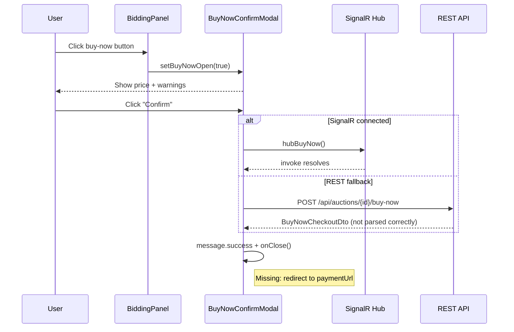
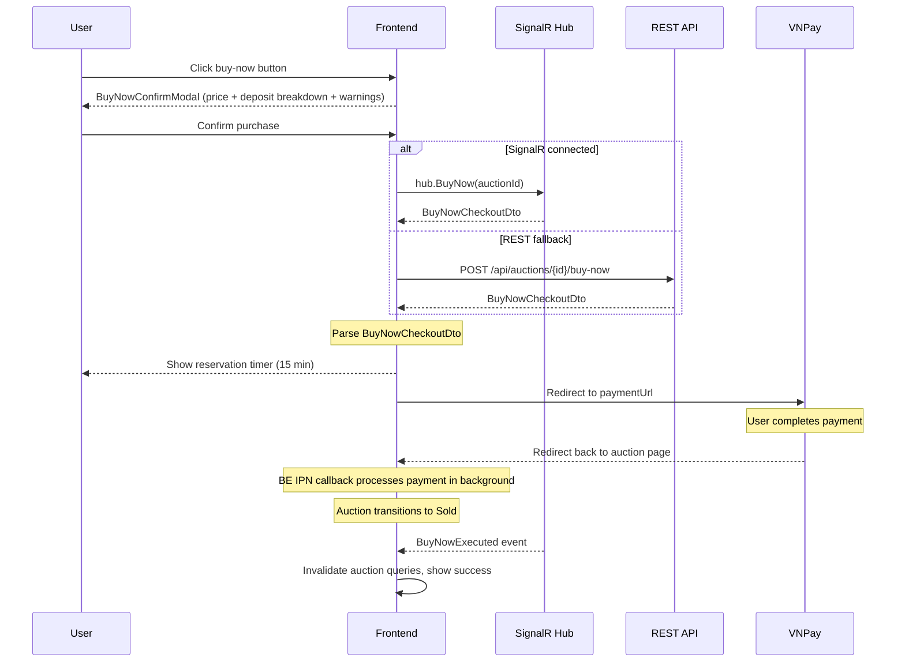

# Flow 08 -- Buy Now (Frontend)

> **Status**: Partial
> **Last verified**: 2026-03-21
> **BE docs**: `backend/docs/flows/08-buy-now/`

## Overview

Buy Now provides an instant-purchase path for auctions that have a `buyNowPrice` configured. Instead of waiting for the auction to end, a qualified buyer can lock the auction with a 15-minute reservation, pay through VNPay, and immediately complete the sale. The auction transitions directly to `Sold` status.

The BE flow follows a **reservation + payment** model:
1. Buyer initiates a buy-now reservation (15-minute window).
2. System calculates deposit offset and generates a VNPay payment URL.
3. Buyer completes payment on VNPay.
4. VNPay IPN callback triggers order creation, auction finalization (status `Sold`), and escrow setup.

### FE Implementation Status

| Touchpoint | Status | Description |
|-----------|--------|-------------|
| Buy-now confirmation modal | Implemented | `BuyNowConfirmModal` shows price + warnings |
| REST API call | Implemented | `POST /api/auctions/{id}/buy-now` via `auctionService.buyNow()` |
| SignalR hub action | Implemented | `auctionHubService.buyNow(auctionId)` |
| `BuyNowExecuted` event handling | Implemented | Invalidates auction query cache |
| VNPay redirect after reservation | Not implemented | Should redirect to `paymentUrl` from `BuyNowCheckoutDto` |
| `BuyNowCheckoutDto` response parsing | Not implemented | FE type `BuyNowResponse` does not match BE response |
| Reservation timer display | Not implemented | Should show 15-minute countdown after reservation |
| Deposit auto-apply display | Not implemented | BE applies held deposit; FE does not show the breakdown |
| `BuyNowReserved` event handling | Not implemented | Should notify other bidders that auction is locked |
| `BuyNowReservationReleased` event handling | Not implemented | Should notify bidders that auction is unlocked |
| Auction lock indicator | Not implemented | Other bidders should see "Buy-now in progress" |
| VNPay payment callback handling | Not implemented | BE-only (IPN server-to-server) |
| Late payment wallet credit | Not implemented | BE-only (wallet credit on expired reservation) |
| Reservation expiry job | Not implemented | BE-only (background job every 1 minute) |
| Deposit funding (split escrow) | Not implemented | BE-only (deposit converted to payment internally) |
| VNPay token management | Not implemented | BE-only (auto-create/update PaymentMethod from token) |
| VNPay refund | Not implemented | Admin-only endpoint, no FE consumer |

### What the FE Does NOT Do

- IPN callback handling (server-to-server, VNPay to BE directly)
- Reservation expiry (BE background job polls every 1 minute)
- Deposit-to-payment conversion (BE internal wallet debit + escrow creation)
- HMAC-SHA512 signature validation (BE only)
- VNPay token auto-linking (BE best-effort on callback)
- VNPay gateway refunds (admin-only)

## User Flow (Current Implementation)



### Target Flow (Full Implementation)



## Component Hierarchy

```
AuctionDetailPage
└── BiddingPanel (orchestrator)
    ├── Buy-now button                   -- visible when hasBuyNow + qualified
    └── BuyNowConfirmModal               -- confirmation + dual-channel action
        ├── Price display                -- buyNowPrice in large orange text
        ├── Warning alert                -- "Auction ends immediately"
        └── Info alert                   -- "Simulated feature" note
```

## API Endpoints

| # | Method | URL | FE Function | Status |
|---|--------|-----|-------------|--------|
| 1 | `POST` | `/api/auctions/{id}/buy-now` | `auctionService.buyNow()` | Partial (no VNPay redirect) |

### SignalR Hub

| Direction | Method/Event | Purpose | Status |
|-----------|-------------|---------|--------|
| Client -> Server | `BuyNow(auctionId)` | Initiate buy-now reservation | Implemented |
| Server -> Client | `BuyNowExecuted` | Buy-now purchase completed | Implemented |
| Server -> Client | `BuyNowReserved` (from `AuctionBuyNowReservedEvent`) | Auction locked by reservation | Not handled |
| Server -> Client | `BuyNowReservationReleased` (from `AuctionBuyNowReservationReleasedEvent`) | Auction unlocked | Not handled |

## BE Response: BuyNowCheckoutDto

Returned by `POST /api/auctions/{id}/buy-now` (201 Created):

```
BuyNowCheckoutDto
  ReservationId       : Guid      -- unique reservation ID
  PaymentUrl          : string    -- VNPay redirect URL
  ExpiresAt           : DateTime  -- reservation.ExpiresAt (now + 15 min)
  BuyNowPrice         : MoneyDto  -- full buy-now price
  DepositAppliedAmount: MoneyDto  -- portion offset by held deposit
  AmountDue           : MoneyDto  -- gateway amount buyer pays via VNPay
```

### FE Response Type (Current -- Incorrect)

```typescript
export interface BuyNowResponse {
  orderId: string;
  finalPrice: number;
}
```

This does not match the BE response. Needs to be updated to match `BuyNowCheckoutDto`.

## State Management

### TanStack Query Keys

| Key | Invalidated When | Purpose |
|-----|-----------------|---------|
| `['auction', auctionId]` | `useBuyNow` success, `BuyNowExecuted` event | Refresh auction detail (status, winner) |
| `['wallet', 'me']` | `useBuyNow` success | Refresh wallet balance |
| `['myBids']` | `useBuyNow` success | Refresh user's bid/order list |

## Reservation State Machine (BE)

```
[*] --> PendingPayment : InitiateBuyNowReservation
PendingPayment --> Paid : MarkPaid (via FinalizeBuyNowReservation)
PendingPayment --> Expired : Expire (via ExpireBuyNowReservationsJob)
PendingPayment --> Failed : Fail(reason)
PendingPayment --> Cancelled : Cancel(reason)
```

Terminal states: `Paid`, `Expired`, `Failed`, `Cancelled`.

## Key Invariants (BE-Enforced)

| Invariant | Enforcement |
|-----------|-------------|
| One active reservation per auction | `EnsureCanInitiateBuyNow` rejects if active reservation exists |
| Locks bidding while active | `EnsureNotLockedByBuyNowReservation` called in PlaceBid/SealedBid/AutoBid |
| 15-minute reservation window | Hardcoded `TimeSpan.FromMinutes(15)` |
| Deposit auto-applied | `min(heldDeposit, buyNowPrice)` applied; remainder via VNPay |
| Funding split must balance | `depositApplied + gatewayAmountDue == buyNowPrice` |
| Only Scheduled auctions with open qualification | `Status == Scheduled` and qualification window open |

## Subflow Index

| File | Topic | Status |
|------|-------|--------|
| [01-initiate-reservation.md](./01-initiate-reservation.md) | Reservation creation, BuyNowConfirmModal, API call | Partial |
| [02-payment-callback.md](./02-payment-callback.md) | VNPay IPN callback decision tree | Not implemented |
| [03-finalize.md](./03-finalize.md) | Domain finalization: bids cancelled, winner set, auction Sold | Not implemented |
| [04-late-payment.md](./04-late-payment.md) | Late payment: wallet credit + reservation failure | Not implemented |
| [05-reservation-expiry.md](./05-reservation-expiry.md) | Background job: expire stale reservations | Not implemented |
| [06-deposit-funding.md](./06-deposit-funding.md) | Deposit converted to payment, split escrow | Not implemented |
| [07-vnpay-token-flows.md](./07-vnpay-token-flows.md) | VNPay token create/pay/remove flows | Not implemented |
| [08-ipn-return.md](./08-ipn-return.md) | IPN + Return URL callback endpoints | BE-only |
| [09-refund.md](./09-refund.md) | VNPay refund (admin-only) | Not implemented |

## Source Files

| Category | File | Path |
|----------|------|------|
| **Component** | BuyNowConfirmModal | `src/components/auction/BuyNowConfirmModal.tsx` |
| **Component** | BiddingPanel (orchestrator) | `src/components/auction/BiddingPanel.tsx` |
| **Service** | Buy-now REST call | `src/services/auctionService.ts` -- `buyNow()` |
| **Service** | SignalR hub action | `src/services/auctionHubService.ts` -- `buyNow()` |
| **Hook** | Buy-now mutation | `src/hooks/useBidding.ts` -- `useBuyNow()` |
| **Hook** | SignalR hub lifecycle | `src/hooks/useAuctionHub.ts` -- `buyNow` callback |
| **Types** | FE response type (incorrect) | `src/types/auction.ts` -- `BuyNowResponse` |
| **Types** | SignalR notification | `src/types/signalr.ts` -- `BuyNowNotification` |
| **Page** | Auction detail (hosts BiddingPanel) | `src/pages/public/AuctionDetailPage.tsx` |
| **i18n** | Vietnamese labels | `src/locales/vi/common.json` -- `bidding.buyNow*` |
| **i18n** | English labels | `src/locales/en/common.json` -- `bidding.buyNow*` |
