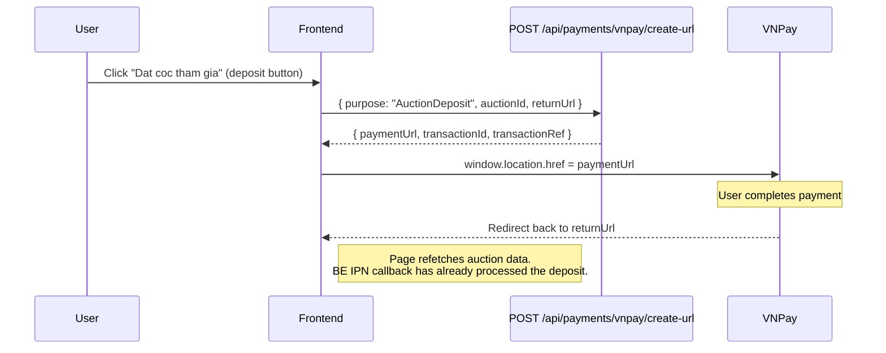

# 01 -- Create VNPay Payment URL (Frontend)

> **Status**: Implemented
> **Service**: `auctionService.createDepositUrl()`
> **Hook**: `useBidding.useJoinAuction()`
> **BE endpoint**: `POST /api/payments/vnpay/create-url`

## Overview

The FE creates a VNPay payment URL by calling `POST /api/payments/vnpay/create-url` with a purpose string and relevant IDs. The BE returns a `paymentUrl` that the FE uses to redirect the user to VNPay's payment page. After the user completes payment on VNPay, they are redirected back to the platform.

Currently, only the `AuctionDeposit` purpose is implemented in the FE. The `wallet_top_up` purpose exists in the BE but the FE `AddFundsModal` is still a mock.

## User Flow



## Service Function

**File**: `src/services/auctionService.ts`

```typescript
export async function createDepositUrl(
  auctionId: string,
  returnUrl: string
): Promise<string>
```

### Request

```typescript
POST /api/payments/vnpay/create-url
{
  purpose: 'AuctionDeposit',
  auctionId: string,
  returnUrl: string
}
```

Note: The FE sends `purpose: 'AuctionDeposit'` (PascalCase). The BE accepts both `AuctionDeposit` and `auction_deposit` forms. The `returnUrl` is passed but the BE actually constructs its own return URL from `AppInfo.BeUrl + VnPayConfig.ReturnPath` -- the FE `returnUrl` is not used by VNPay directly.

### Response

The BE returns one of two shapes (the service handles both):
- Direct: `{ paymentUrl: string, transactionId: string, transactionRef: string }`
- Wrapped: `{ data: { paymentUrl: string, ... } }`

The service extracts `paymentUrl` from either shape:
```typescript
const raw = (data as Record<string, unknown>)?.data ?? data;
return (raw as Record<string, unknown>).paymentUrl as string;
```

### Error Cases

| Error | BE Reason | When |
|-------|-----------|------|
| `SelfBid` | Seller tries to deposit on own auction | `auction.sellerId === currentUser.id` |
| `InvalidState` | Auction is cancelled/ended/sold/failed | Terminal auction status |
| `JoinWindowNotOpenYet` | Qualification window has not started | `now < qualificationStartAt` |
| `JoinWindowClosed` | Qualification window has ended | `now > qualificationEndAt` |
| `AlreadyHeld` | User already has a held deposit | Duplicate deposit attempt |

## Mutation Hook

**File**: `src/hooks/useBidding.ts`

```typescript
export function useJoinAuction() {
  return useMutation({
    mutationFn: ({ auctionId, returnUrl }) => createDepositUrl(auctionId, returnUrl),
  });
}
```

No cache invalidation is needed because the user is redirected to VNPay. When they return, the page refetches auction data automatically (standard TanStack Query refetch on mount).

## Triggering Component

**File**: `src/components/auction/QualificationSection.tsx`

The `QualificationSection` component calls `useJoinAuction()` when the user clicks the deposit button. On success, it redirects:

```typescript
const returnUrl = window.location.href; // Current auction page
joinAuction.mutate({ auctionId, returnUrl }, {
  onSuccess: (paymentUrl) => {
    window.location.href = paymentUrl;
  },
});
```

## BE Request DTO (Reference)

The full BE command accepts more fields than the FE currently sends:

| Field | Type | FE Sends? | Description |
|-------|------|-----------|-------------|
| `Amount` | `decimal` | No | BE calculates from auction deposit amount |
| `Currency` | `string` | No | Defaults to VND |
| `Purpose` | `string` | Yes | `"AuctionDeposit"` |
| `IpAddress` | `IPAddress` | No | Resolved from HttpContext |
| `Description` | `string` | No | BE generates automatically |
| `BankCode` | `string?` | No | Optional bank filter |
| `AuctionId` | `Guid?` | Yes | Required for deposit purpose |
| `OrderId` | `Guid?` | No | Used for order_payment purpose |
| `BuyNowReservationId` | `Guid?` | No | Used for buy-now purpose |
| `PaymentMethodId` | `Guid?` | No | Used for token_pay flow |
| `SaveCard` | `bool` | No | Used for pay_and_create flow |

## Not Yet Implemented (FE)

The following `purpose` values are supported by the BE but not yet called from the FE:

| Purpose | BE Value | FE Status | Would Be Used By |
|---------|----------|-----------|-----------------|
| Auction Deposit | `auction_deposit` | Implemented | `QualificationSection` |
| Wallet Top-Up | `wallet_top_up` | Not implemented | `AddFundsModal` (currently mock) |
| Order Payment | `order_payment` | Not implemented | Order checkout page |
| Auction Buy-Now | `auction_buy_now` | Not implemented | Buy-now flow with VNPay |
