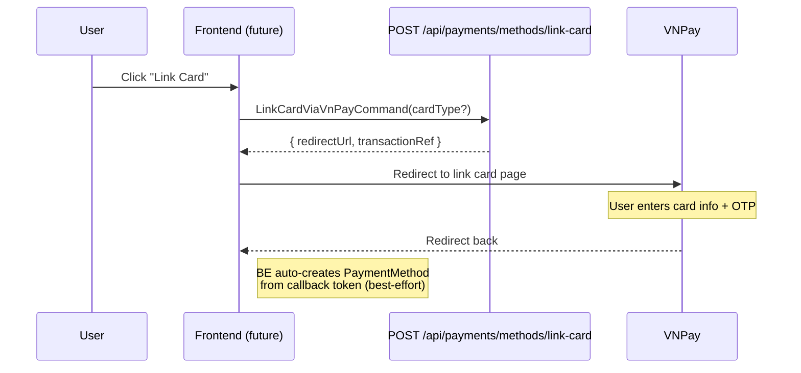

# 05 -- Token Management (Frontend)

> **Status**: Not implemented
> **BE endpoints**: `/api/payments/methods/*`
> **BE docs**: `backend/docs/flows/09-payment/05-token-management.md`

## Overview

VNPay token management (saved cards) is not yet implemented on the FE. The BE supports full CRUD on payment methods: link a card via VNPay's `token_create` flow, list saved methods, delete methods (with VNPay token removal), and set a default.

## BE Endpoints Reference

| # | Method | Route | Description |
|---|--------|-------|-------------|
| 1 | POST | `/api/payments/methods/link-card` | Redirect to VNPay to link a card (no charge) |
| 2 | POST | `/api/payments/methods` | Manually add a payment method |
| 3 | GET | `/api/payments/methods` | List user's active payment methods |
| 4 | DELETE | `/api/payments/methods/{id}` | Deactivate + remove VNPay token |
| 5 | PUT | `/api/payments/methods/{id}/default` | Set a payment method as default |

## Link Card Flow (BE Reference)



## PaymentMethod DTO (BE Reference)

```typescript
interface PaymentMethodDto {
  id: string;
  type: string;           // credit_card | debit_card | bank_account | e_wallet | vnpay
  provider: string | null; // "vnpay"
  lastFour: string | null;
  expiryMonth: number | null;
  expiryYear: number | null;
  holderName: string | null;
  isDefault: boolean;
  isActive: boolean;
  createdAt: string;
  maskedCardNumber: string | null; // e.g. "970419xxxxxxxxx2198"
  vnPayCardType: string | null;    // ATM | QRCODE | etc.
  bankCode: string | null;
}
```

## Auto-Creation from Payment

When a user pays via `pay_and_create` flow (checkbox "Save card for future payments"), the BE callback handler automatically creates a `PaymentMethod` from the VNPay token. This happens transparently -- the FE does not need to do anything special.

## FE Implementation Plan

When implemented, token management would need:

### Service Functions

```typescript
// src/services/paymentService.ts
export async function linkCard(cardType?: string): Promise<{ redirectUrl: string }>;
export async function getPaymentMethods(): Promise<PaymentMethodDto[]>;
export async function deletePaymentMethod(id: string): Promise<void>;
export async function setDefaultPaymentMethod(id: string): Promise<void>;
```

### Component

A "Payment Methods" section in the user's profile or wallet page:
- List saved cards with masked number, bank, card type
- "Link New Card" button (redirects to VNPay)
- Delete card (with confirmation)
- Set default card (radio/star toggle)

### Integration with Checkout

Once token management is implemented, the checkout flow can offer `token_pay` as an option -- paying with a saved card without re-entering details.

See `backend/docs/flows/09-payment/05-token-management.md` for full details on token flows and auto-creation logic.
