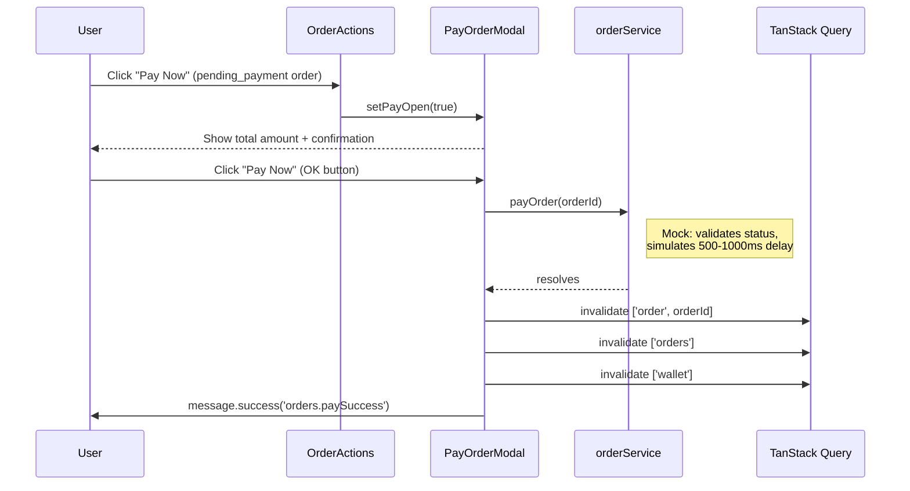

# 02 -- Checkout Payment (Frontend)

> **Status**: Mock
> **Component**: `PayOrderModal`
> **Service**: `orderService.payOrder()`
> **Hook**: `useOrders.usePayOrder()`
> **BE endpoint**: `POST /api/payments/checkout`
> **BE docs**: `backend/docs/flows/10-order-lifecycle/02-checkout-payment.md`

## Overview

The FE has a `PayOrderModal` that simulates wallet-based order payment. It shows the total amount, asks for confirmation, and calls a mock `payOrder()` function. The BE supports three payment methods (vnpay, wallet, wallet_vnpay) via `POST /api/payments/checkout`, none of which are integrated yet.

## Current Mock Behavior

### User Flow (Mock)



### Component: PayOrderModal

**File**: `src/components/orders/PayOrderModal.tsx`

```typescript
interface PayOrderModalProps {
  open: boolean;
  onClose: () => void;
  orderId: string;
  totalAmount: number;
}
```

The modal displays:
- Total amount in VND (large, centered, blue)
- Confirmation text with the formatted amount
- Info alert explaining the payment will deduct from wallet
- OK button triggers `usePayOrder().mutate(orderId)`

### Service Function (Mock)

**File**: `src/services/orderService.ts`

```typescript
export async function payOrder(orderId: string): Promise<void>
```

Mock behavior:
- Simulates 500-1000ms delay
- Validates the order exists and has `pending_payment` status
- Does NOT actually change any state (mock orders are static)

### Mutation Hook

**File**: `src/hooks/useOrders.ts`

```typescript
export function usePayOrder(): UseMutationResult<void, Error, string>
```

On success:
- Invalidates `['order', orderId]`, `['orders']`, and `['wallet']` queries
- Shows success toast via `message.success(t('orders.paySuccess'))`

## What the Real Integration Needs

### BE Endpoint

```
POST /api/payments/checkout
Auth: Authenticated
```

### Request

```typescript
{
  orderId: string;       // Required
  bankCode?: string;     // Optional bank filter for VNPay
  paymentMethod: string; // "vnpay" | "wallet" | "wallet_vnpay"
}
```

### Response

```typescript
{
  transactionId: string;
  transactionRef: string;
  paymentUrl: string | null;  // null for full wallet payment
}
```

### Three Payment Method Flows

| Method | Wallet Deduction | VNPay Redirect | Escrow Created |
|--------|-----------------|----------------|----------------|
| `vnpay` | None | Yes (full amount) | After IPN callback |
| `wallet` | Full amount from wallet | No (`paymentUrl = null`) | Immediately |
| `wallet_vnpay` | Partial (wallet balance) | Yes (remaining amount) | After IPN callback |

### Integration Changes Required

1. **New service function** in `orderService.ts` or `paymentService.ts`:
   ```typescript
   export async function checkoutOrder(request: {
     orderId: string;
     paymentMethod: 'vnpay' | 'wallet' | 'wallet_vnpay';
     bankCode?: string;
   }): Promise<{
     transactionId: string;
     transactionRef: string;
     paymentUrl: string | null;
   }>
   ```

2. **PayOrderModal redesign**: Add payment method selector (radio group or segmented control) with three options. Show wallet balance to help the user choose.

3. **VNPay redirect handling**: When `paymentUrl` is not null, redirect user via `window.location.href = paymentUrl`. On return from VNPay, refetch order data.

4. **Wallet balance check**: Before allowing wallet payment, fetch and display the user's available balance. Disable the wallet option if balance is insufficient.

5. **Winner deposit display**: The BE automatically applies the winner's auction deposit during checkout. The FE should display this: "Deposit of X VND will be applied to your payment."

6. **Payment deadline**: Show a countdown timer for the 48-hour payment deadline (`order.paymentDueAt`). The FE `Order` type currently lacks this field -- it exists in `OrderDto` from the BE.

### Gap: FE Order Type vs. BE OrderDto

The FE `Order` type does not include `paymentDueAt`. The BE `OrderDto` includes it. This field is needed to:
- Show payment deadline countdown on `pending_payment` orders
- Display "Payment due by: {date}" in the PayOrderModal
