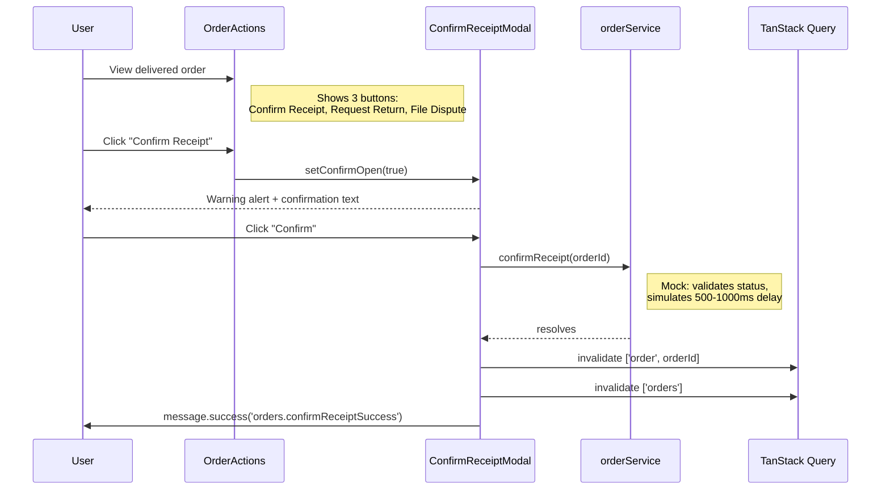

# 06 -- Decision Window (Frontend)

> **Status**: Mock
> **Components**: `ConfirmReceiptModal`, `OrderActions`
> **Service**: `orderService.confirmReceipt()`
> **Hook**: `useOrders.useConfirmReceipt()`
> **BE docs**: `backend/docs/flows/10-order-lifecycle/06-decision-window.md`

## Overview

After delivery, a 7-day decision window gives the buyer time to inspect the item and optionally request a return. The FE has a `ConfirmReceiptModal` that simulates confirming receipt (which in the real system would be unnecessary -- the decision window auto-expires). The FE does NOT display the decision window countdown or expiry date.

## Current Mock Behavior

### User Flow (Mock)



### Component: ConfirmReceiptModal

**File**: `src/components/orders/ConfirmReceiptModal.tsx`

```typescript
interface ConfirmReceiptModalProps {
  open: boolean;
  onClose: () => void;
  orderId: string;
}
```

The modal shows:
- Warning alert: `t('orders.confirmReceiptWarning')` -- warns that confirming releases payment to seller and closes the return window
- Confirmation text asking the user to confirm receipt
- OK button triggers `useConfirmReceipt().mutate(orderId)`

### Component: OrderActions (Delivered State)

**File**: `src/components/orders/OrderActions.tsx`

When `order.status === 'delivered'`, three action buttons are shown:

| Button | Icon | Action |
|--------|------|--------|
| Confirm Receipt | `CheckCircleOutlined` | Opens `ConfirmReceiptModal` |
| Request Return | `RollbackOutlined` | Opens `RequestReturnModal` |
| File Dispute | `ExclamationCircleOutlined` | No-op (button exists, no handler) |

### Service Function (Mock)

**File**: `src/services/orderService.ts`

```typescript
export async function confirmReceipt(orderId: string): Promise<void>
```

Mock behavior:
- Simulates 500-1000ms delay
- Validates the order exists and has `delivered` status
- Does NOT actually change any state

### Mutation Hook

**File**: `src/hooks/useOrders.ts`

```typescript
export function useConfirmReceipt(): UseMutationResult<void, Error, string>
```

On success: invalidates `['order', orderId]` and `['orders']` queries.

## What the Real Integration Needs

### BE Decision Window Behavior

The BE does NOT have a "confirm receipt" endpoint. Instead:

1. When the order is delivered, `DecisionWindowEndsAt = deliveredAt + 7 days` is set automatically
2. `ReleaseExpiredDecisionWindowJob` runs every 10 minutes, finds delivered orders with expired decision windows (and no active return/dispute), and calls `EscrowSettlementService.ReleaseToSellerAsync()`
3. This releases all held escrow to the seller's wallet and marks the order as `Completed`

The buyer does NOT need to explicitly confirm receipt. The window simply expires and funds are released automatically.

### Candidate Query (BE Job)

Orders eligible for auto-completion:
- `Status == Delivered`
- `DisputedAt == null`
- `DecisionWindowEndsAt != null`
- `DecisionWindowEndsAt <= utcNow`
- No active return (return is null, or return status is Rejected/Cancelled/Resolved)

### Integration Changes Required

1. **Remove or redesign ConfirmReceiptModal**: Since the BE has no "confirm receipt" endpoint, this modal is misleading. Options:
   - **Remove it entirely**: Let the decision window auto-expire (BE behavior)
   - **Repurpose as "early complete"**: If the BE adds an endpoint for buyers to waive the decision window, the modal could call that
   - **Keep as informational**: Show "Your return window expires on {date}. After that, payment will be released to the seller."

2. **Decision window countdown**: Add a countdown display for `delivered` orders:
   ```typescript
   // In OrderActions or OrderPaymentInfo for delivered orders:
   const daysLeft = Math.ceil(
     (new Date(order.decisionWindowEndsAt).getTime() - Date.now()) / (1000 * 60 * 60 * 24)
   );
   // Show: "Return window: 5 days remaining" or "Return window expired"
   ```

3. **Add `decisionWindowEndsAt` to FE Order type**: The BE `OrderDto` includes `decisionWindowEndsAt: DateTime?`. The FE `Order` type does not have this field.

4. **File Dispute button**: The "File Dispute" button in `OrderActions` currently has no handler. The dispute flow is a separate module not covered here. When implemented, it should only be available within the decision window.

### Gap: FE "Confirm Receipt" vs. BE Auto-Completion

| Concept | FE Mock | BE Reality |
|---------|---------|------------|
| Confirm receipt | Explicit button + modal | No such action; window auto-expires |
| Escrow release trigger | Mock `confirmReceipt()` | `ReleaseExpiredDecisionWindowJob` (automatic) |
| When funds release | Immediately on confirm | 7 days after delivery (configurable) |
| Buyer action needed | Yes (click confirm) | No (passive; only act if returning) |
