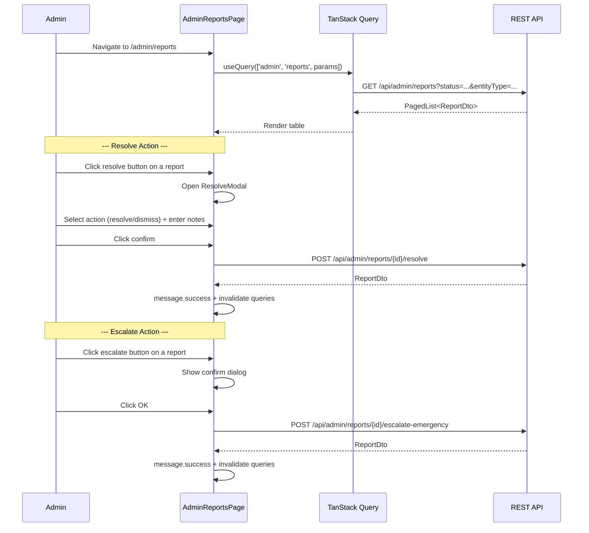

# 02 -- Admin Report Management (Frontend)

> **Status**: Implemented
> **Components**: `AdminReportsPage`
> **Service**: `adminService.getReports()`, `adminService.resolveReport()`, `adminService.escalateReportEmergency()`
> **Hook**: `useAdmin.useAdminReports()`, `useAdmin.useResolveReport()`, `useAdmin.useEscalateReportEmergency()`

## Overview

The admin report management page lets administrators view, filter, resolve, and escalate user-submitted reports. It displays a paginated table of reports with status filters, and provides two actions per report: resolve (with dismiss/action-taken toggle) and escalate to auction emergency.

## Page Flow



## Component: AdminReportsPage

**File**: `src/pages/admin/AdminReportsPage.tsx`
**Route**: `/admin/reports`

### Layout

```
AdminReportsPage
├── Header (title + subtitle with total count + refresh button)
├── Filter bar
│   ├── Status filter (Select: pending, under_review, resolved, escalated)
│   └── Entity type filter (Select: auction, user, item)
├── Reports table (Ant Design Table)
│   ├── Entity column (entityType tag + truncated entityId)
│   ├── Reason column (reasonCode tag)
│   ├── Status column (Badge with color-coded status)
│   ├── Assigned To column (truncated UUID or "Not assigned")
│   ├── Created At column (DD/MM/YYYY format)
│   └── Actions column (resolve + escalate buttons)
└── Resolve Modal
    ├── Action select (Resolve / Dismiss)
    └── Resolution notes textarea
```

### State Management

| State | Type | Purpose |
|-------|------|---------|
| `params` | `GetReportsParams` | Filter + pagination state (PageNumber, PageSize, status, entityType) |
| `resolveModal` | `{ open: boolean; id: string \| null }` | Controls resolve modal visibility |
| `resolutionNotes` | `string` | Text input for resolution notes |
| `dismissed` | `boolean` | Whether to dismiss (true) or take action (false) |

### Query

```typescript
const { data, isFetching, refetch } = useQuery({
  queryKey: ['admin', 'reports', params],
  queryFn: () => getReports(params),
  placeholderData: (prev) => prev,
});
```

- **Cache key**: `['admin', 'reports', params]`
- **Pagination**: Server-side via `PageNumber` / `PageSize` (15 per page)
- **Placeholder data**: Previous data shown during refetch to avoid layout flash

### Mutations

#### Resolve Report

```typescript
const resolveMutation = useMutation({
  mutationFn: ({ id, notes, dis }) =>
    resolveReport(id, { dismissed: dis, resolutionNotes: notes }),
  onSuccess: () => {
    message.success(t('admin.reports.resolved'));
    // Close modal, clear notes, invalidate queries
  },
});
```

**BE endpoint**: `POST /api/admin/reports/{reportId}/resolve`

**Request body**:
```typescript
{
  dismissed: boolean;           // true = dismiss, false = action taken
  resolutionNotes: string;      // Admin's explanation
}
```

**BE side effects**:
- Sets report status to `ActionTaken` or `Dismissed`
- Audit log entry created
- Notification sent to reporter (event: `report_resolved` or `report_dismissed`)

#### Escalate to Emergency

```typescript
const escalateMutation = useMutation({
  mutationFn: (id: string) => escalateReportEmergency(id, {}),
  onSuccess: () => { message.success(t('admin.reports.escalated')); invalidate(); },
});
```

**BE endpoint**: `POST /api/admin/reports/{reportId}/escalate-emergency`

**Precondition**: Report must be for an `Auction` entity type. BE returns `400 Report.UnsupportedEmergencyEntity` otherwise.

**BE side effects**:
- Dispatches `TriggerAuctionEmergencyCommand` (terminates auction, refunds escrow, flags seller)
- Sets `report.EscalatedEmergencyAt` and `Status = ActionTaken`
- Audit log entry created

### Table Columns

| Column | Data Source | Rendering |
|--------|------------|-----------|
| Entity | `entityType` + `entityId` | Purple tag + truncated UUID |
| Reason | `reasonCode` | Tag |
| Status | `status` | Badge with color: pending=warning, under_review=processing, resolved=success, escalated=error |
| Assigned To | `assignedTo` | Truncated UUID code or "Not assigned" secondary text |
| Created At | `createdAt` | `DD/MM/YYYY` via dayjs |
| Actions | -- | Resolve button (disabled if resolved) + Escalate button (disabled if resolved/escalated) |

### Filter Options

| Filter | Options |
|--------|---------|
| Status | `pending`, `under_review`, `resolved`, `escalated` |
| Entity Type | `auction`, `user`, `item` |

### Escalate Confirmation

Before escalation, a confirmation modal appears via `App.useApp().modal.confirm()`:
- Title: `t('admin.reports.escalateConfirm')`
- Content: `t('admin.reports.escalateContent')`
- OK button styled as danger

## Not Yet Implemented in This Page

The following service function exists in `adminService.ts` but is **not wired** to any UI action in this page:

| Function | Purpose | Notes |
|----------|---------|-------|
| `assignReport(reportId, { assignedToUserId })` | Assign report to an admin | Hook `useAssignReport()` exists in `useAdmin.ts` but no "Assign" button in UI |

The `assignedTo` column displays the UUID but there is no way to change assignment from this page.

## Service Functions

**File**: `src/services/adminService.ts`

```typescript
// GET /api/admin/reports
export async function getReports(params: GetReportsParams = {}): Promise<PagedList<ReportDto>>;

// POST /api/admin/reports/{id}/assign
export async function assignReport(reportId: string, data: AssignReportRequest): Promise<ReportDto>;

// POST /api/admin/reports/{id}/escalate-emergency
export async function escalateReportEmergency(reportId: string, data: EscalateReportEmergencyRequest): Promise<ReportDto>;

// POST /api/admin/reports/{id}/resolve
export async function resolveReport(reportId: string, data: ResolveReportRequest): Promise<ReportDto>;
```

## TypeScript Types

**File**: `src/services/adminService.ts`

```typescript
interface ReportDto {
  id: string;
  reporterId: string | null;
  entityType: string | null;
  entityId: string | null;
  reasonCode: string | null;
  description: string | null;
  status: string | null;
  assignedTo: string | null;
  createdAt: string;
  resolvedAt: string | null;
  resolutionNotes: string | null;
}

interface GetReportsParams {
  status?: string;
  entityType?: string;
  entityId?: string;
  PageNumber?: number;
  PageSize?: number;
}

interface AssignReportRequest { assignedToUserId?: string | null; }
interface EscalateReportEmergencyRequest { reasonOverride?: string | null; }
interface ResolveReportRequest { dismissed?: boolean; resolutionNotes?: string | null; }
```

## Hooks

**File**: `src/hooks/useAdmin.ts`

| Hook | Purpose | Cache Invalidation |
|------|---------|-------------------|
| `useAdminReports(params)` | Query reports list | -- |
| `useAssignReport()` | Mutation: assign report to admin | `['admin', 'reports']` |
| `useEscalateReportEmergency()` | Mutation: escalate to emergency | `['admin', 'reports']` |
| `useResolveReport()` | Mutation: resolve/dismiss report | `['admin', 'reports']` |

Note: `AdminReportsPage` uses inline `useQuery` / `useMutation` calls rather than these hooks.

## i18n Keys Used

| Key | Context |
|-----|---------|
| `admin.reports.title` | Page title |
| `admin.reports.subtitle` | Subtitle with count |
| `admin.reports.columns.*` | Table column headers |
| `admin.reports.status.*` | Status badge labels |
| `admin.reports.filterStatus` | Status filter placeholder |
| `admin.reports.filterEntityType` | Entity type filter placeholder |
| `admin.reports.entityTypes.*` | Entity type labels |
| `admin.reports.resolve` | Resolve button tooltip |
| `admin.reports.escalate` | Escalate button tooltip |
| `admin.reports.resolved` | Success message after resolve |
| `admin.reports.escalated` | Success message after escalate |
| `admin.reports.notAssigned` | "Not assigned" text |
| `admin.reports.escalateConfirm` | Escalate confirmation title |
| `admin.reports.escalateContent` | Escalate confirmation body |
| `admin.reports.resolveModal.*` | Resolve modal labels |
| `common.refresh` | Refresh button |
| `common.cancel` | Cancel button |
| `common.error.generic` | Generic error toast |
