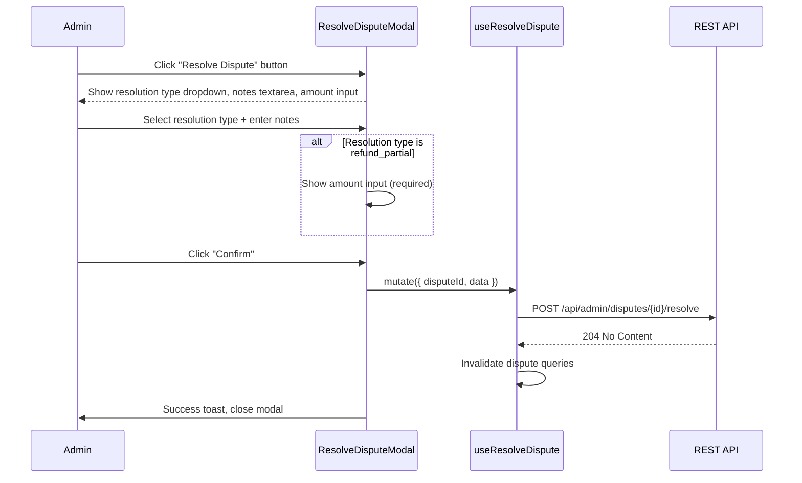

# 05 -- Resolve Dispute (Frontend)

> **Status**: Not implemented (service function exists, no UI)
> **BE endpoint**: `POST /api/admin/disputes/{disputeId}/resolve`
> **BE docs**: `backend/docs/flows/12-dispute-moderation/05-resolve-dispute.md`
> **FE service**: `adminService.resolveDispute()`
> **FE hook**: `useAdmin.useResolveDispute()`

## Overview

Dispute resolution is an admin-only action that closes a dispute with a specific resolution type and optionally settles escrow funds between buyer and seller. The FE has the service function and hook ready (`resolveDispute` in `adminService.ts`, `useResolveDispute` in `useAdmin.ts`) but no UI page or modal to invoke them.

## Existing FE Code

### Service Function

**File**: `src/services/adminService.ts`

```typescript
export async function resolveDispute(disputeId: string, data: ResolveDisputeRequest): Promise<void> {
  await api.post(`/api/admin/disputes/${disputeId}/resolve`, data);
}
```

### Request Type

```typescript
interface ResolveDisputeRequest {
  resolutionType?: string | null;   // One of the 9 ResolutionType enum values
  notes?: string | null;            // Admin explanation
  amount?: number | null;           // Required for refund_partial
}
```

### Hook

**File**: `src/hooks/useAdmin.ts`

```typescript
export function useResolveDispute() {
  return useMutation({
    mutationFn: ({ disputeId, data }: { disputeId: string; data: ResolveDisputeRequest }) =>
      resolveDispute(disputeId, data),
  });
}
```

Note: No cache invalidation is configured on this hook. When the UI is built, it should invalidate the dispute list and detail queries.

## BE Endpoint Reference

### POST /api/admin/disputes/{disputeId}/resolve

**Auth**: `Admin.ManageItems` permission

#### Request

```typescript
{
  resolutionType: string;     // Required: one of 9 ResolutionType values
  notes?: string;             // Optional: admin explanation
  amount?: number;            // Required when resolutionType = "refund_partial"
}
```

#### Response

- **204 No Content** on success
- **400** -- invalid resolution type, or invalid amount for partial refund
- **404** -- dispute not found
- **409** -- dispute already resolved or closed

### Resolution Types and Escrow Actions

| Resolution Type | Escrow Action | Order Outcome |
|----------------|---------------|---------------|
| `no_resolution` | None | No change |
| `refund_full` | Full escrow refunded to buyer | `MarkAsRefunded()` |
| `refund_partial` | `amount` to buyer, remainder to seller | `MarkAsRefunded()` |
| `replacement` | None | No change |
| `favor_buyer` | Full escrow refunded to buyer | `MarkAsRefunded()` |
| `favor_seller` | Full escrow released to seller | `Complete()` |
| `mutual_agreement` | Full escrow released to seller | `Complete()` |
| `no_action` | None | No change |
| `cancelled` | None | No change |

### Partial Refund Details

When `resolutionType = "refund_partial"`:
- `amount` field is **required**
- Must satisfy: `0 < amount <= totalHeldEscrowAmount`
- Buyer receives `amount` via a `REFUND` transaction
- Seller receives `totalHeld - amount` via a `PAYOUT-PART` transaction

### BE Side Effects

1. Sets `dispute.status = "resolved"`, records in `StatusHistory`
2. Marks linked order as disputed (if order exists)
3. Settles escrow based on resolution type (see table above)
4. Publishes `DisputeChangedEvent` which triggers:
   - SignalR broadcast: `DisputeUpdated` to all participants
   - Notifications to complainant, respondent, and assigned admin (event: `dispute_updated`)

### Error Codes

| Code | HTTP | Condition |
|------|------|-----------|
| `Dispute.NotFound` | 404 | Dispute ID does not exist |
| `Dispute.InvalidResolutionType` | 400 | String does not match any ResolutionType value |
| `Dispute.AlreadyResolved` | 409 | Dispute is already resolved or closed |
| `Refund.InvalidAmount` | 400 | Amount <= 0 or exceeds total held escrow |
| `Wallet.NotFound` | 404 | Buyer or seller wallet not found |
| `Order.EscrowNotFound` | 404 | No escrows with "holding" status for the order |

## FE Implementation Plan

### Where It Would Live

The resolve action would be placed in the `DisputeDetailPage` (see [03-dispute-overview.md](./03-dispute-overview.md)), visible only to admin users.

### Proposed Flow



### Proposed Component

```
ResolveDisputeModal
├── ResolutionType select (9 options with descriptions)
├── Notes textarea
├── Amount input (conditionally shown for refund_partial)
├── Warning text (explains escrow impact of selected resolution)
└── Confirm / Cancel buttons
```

### Cache Invalidation (To Add)

When implemented, `useResolveDispute` should be updated to invalidate:
- `['disputes']` -- dispute list
- `['disputes', disputeId]` -- dispute detail
- `['admin', 'payments', 'escrows']` -- if escrow was settled
