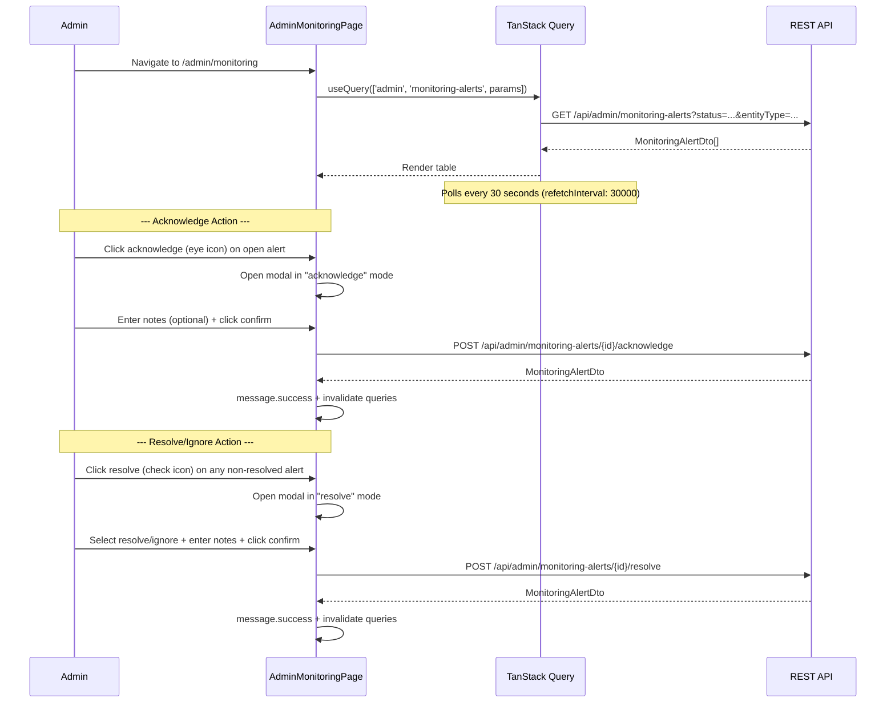

# 06 -- Monitoring Alerts (Frontend)

> **Status**: Implemented
> **Components**: `AdminMonitoringPage`
> **Service**: `adminService.getMonitoringAlerts()`, `adminService.acknowledgeMonitoringAlert()`, `adminService.resolveMonitoringAlert()`
> **Hook**: `useAdmin.useMonitoringAlerts()`, `useAdmin.useAcknowledgeMonitoringAlert()`, `useAdmin.useResolveMonitoringAlert()`

## Overview

The admin monitoring alerts page displays system-generated and manually-created alerts in a real-time table. Alerts are auto-created by background jobs (collusion detection, brute-force login, non-payment) and can also be manually created by admins for specific auctions. Admins can acknowledge and resolve/ignore alerts. The page polls every 30 seconds for new alerts.

## Page Flow



## Component: AdminMonitoringPage

**File**: `src/pages/admin/AdminMonitoringPage.tsx`
**Route**: `/admin/monitoring`

### Layout

```
AdminMonitoringPage
├── Header (title + subtitle with open alert count + refresh button)
├── Filter bar
│   ├── Status filter (Select: open, acknowledged, resolved)
│   └── Entity type filter (Select: auction, user, payment)
├── Alerts table (Ant Design Table)
│   ├── Entity column (entityType tag + alertType text)
│   ├── Severity column (color-coded tag: critical=red, high=orange, medium=gold, low=blue)
│   ├── Status column (Badge: open=warning, acknowledged=processing, resolved=success)
│   ├── Notes column (text or dash if empty)
│   ├── Created At column (DD/MM HH:mm with full timestamp tooltip)
│   └── Actions column (acknowledge + resolve buttons)
└── Action Modal (shared for acknowledge and resolve)
    ├── Action select (resolve mode only: Resolve / Ignore)
    └── Notes textarea
```

### State Management

| State | Type | Purpose |
|-------|------|---------|
| `params` | `GetMonitoringAlertsParams` | Filter state (status, entityType) |
| `resolveModal` | `{ open: boolean; id: string \| null; mode: 'acknowledge' \| 'resolve' }` | Controls modal visibility and mode |
| `notes` | `string` | Notes textarea value |
| `ignored` | `boolean` | Whether to ignore (true) or resolve (false) when in resolve mode |

### Query

```typescript
const { data: alerts = [], isFetching, refetch } = useQuery({
  queryKey: ['admin', 'monitoring-alerts', params],
  queryFn: () => getMonitoringAlerts(params),
  refetchInterval: 30 * 1000,     // Polls every 30 seconds for new alerts
});
```

- **Cache key**: `['admin', 'monitoring-alerts', params]`
- **No pagination**: Returns full array (BE does not paginate this endpoint)
- **Auto-polling**: `refetchInterval: 30000` ensures near-real-time alert visibility

### Mutations

#### Acknowledge Alert

```typescript
const acknowledgeMutation = useMutation({
  mutationFn: ({ id, n }) => acknowledgeMonitoringAlert(id, { notes: n }),
  onSuccess: () => { message.success(...); closeModal(); invalidate(); },
});
```

**BE endpoint**: `POST /api/admin/monitoring-alerts/{alertId}/acknowledge`

**Request**: `{ notes?: string }`

**BE side effects**:
- Sets `status = "acknowledged"`, `acknowledgedBy = adminId`, `acknowledgedAt = now`
- Audit log: action `monitoring_alert_acknowledged`

#### Resolve Alert

```typescript
const resolveMutation = useMutation({
  mutationFn: ({ id, n, ig }) => resolveMonitoringAlert(id, { notes: n, ignored: ig }),
  onSuccess: () => { message.success(...); closeModal(); invalidate(); },
});
```

**BE endpoint**: `POST /api/admin/monitoring-alerts/{alertId}/resolve`

**Request**: `{ ignored: boolean; notes?: string }`

**BE side effects**:
- Sets `status = "resolved"` (if `ignored=false`) or `status = "ignored"` (if `ignored=true`)
- Sets `resolvedBy = adminId`, `resolvedAt = now`
- Audit log: action `monitoring_alert_resolved` or `monitoring_alert_ignored`

### Table Columns

| Column | Data Source | Rendering |
|--------|------------|-----------|
| Entity | `entityType` + `alertType` | Tag + secondary text |
| Severity | `severity` | Color-coded tag (critical=red, high=orange, medium=gold, low=blue, info=default) |
| Status | `status` | Badge (open=warning, acknowledged=processing, resolved=success) |
| Notes | `notes` | Text or em-dash |
| Created At | `createdAt` | `DD/MM HH:mm` with full `DD/MM/YYYY HH:mm:ss` tooltip |
| Actions | -- | Acknowledge button (open alerts only) + Resolve button (non-resolved alerts only) |

### Row Highlighting

Critical alerts get a danger row class:
```typescript
rowClassName={(r) => r.severity === 'critical' ? 'ant-table-row-danger' : ''}
```

### Modal Behavior

The modal serves dual purpose based on `resolveModal.mode`:

| Mode | Title | Fields | Action |
|------|-------|--------|--------|
| `acknowledge` | Acknowledge modal title | Notes textarea only | Calls `acknowledgeMonitoringAlert()` |
| `resolve` | Resolve modal title | Action select (resolve/ignore) + notes textarea | Calls `resolveMonitoringAlert()` |

## Auto-Created Alert Sources (BE)

The following background jobs and event handlers automatically create alerts:

| Source | Alert Type(s) | Severity | Trigger |
|--------|--------------|----------|---------|
| `ScanActiveAuctionsForCollusionJob` (every 5 min) | `auction_collusion_*` (6 types) | Medium to Critical | Bid pattern analysis: same device, same IP, ping-pong, repeated pair |
| `LoginAttemptedEventHandler` | `login_brute_force` | High | 5 failed login attempts/hour from same IP |
| `LoginAttemptedEventHandler` | `suspicious_login_new_ip` | Medium | Successful login from new IP address |
| `CancelExpiredOrdersJob` | `repeated_non_payment` | Medium | Order expires without payment |

## Alert Lifecycle

```
Open -> Acknowledged -> Resolved
                     -> Ignored
Open -> Resolved (direct, skipping acknowledge)
     -> Ignored (direct, skipping acknowledge)
```

## Service Functions

**File**: `src/services/adminService.ts`

```typescript
export async function getMonitoringAlerts(params: GetMonitoringAlertsParams = {}): Promise<MonitoringAlertDto[]>;
export async function acknowledgeMonitoringAlert(alertId: string, data: AcknowledgeMonitoringAlertRequest): Promise<MonitoringAlertDto>;
export async function resolveMonitoringAlert(alertId: string, data: ResolveMonitoringAlertRequest): Promise<MonitoringAlertDto>;
```

Also available but not used on this page:
```typescript
export async function flagAuction(auctionId: string, data: FlagAuctionRequest): Promise<MonitoringAlertDto>;
```

## TypeScript Types

**File**: `src/services/adminService.ts`

```typescript
interface MonitoringAlertDto {
  id: string;
  entityType: string | null;
  entityId: string | null;
  alertType: string | null;
  severity: string | null;
  payload: unknown;
  status: string | null;
  notes: string | null;
  acknowledgedBy: string | null;
  acknowledgedAt: string | null;
  resolvedBy: string | null;
  resolvedAt: string | null;
  createdAt: string;
}

interface GetMonitoringAlertsParams {
  status?: string;
  entityType?: string;
  entityId?: string;
}

interface AcknowledgeMonitoringAlertRequest { notes?: string | null; }
interface ResolveMonitoringAlertRequest { ignored?: boolean; notes?: string | null; }
```

## Hooks

**File**: `src/hooks/useAdmin.ts`

| Hook | Purpose | Cache Invalidation |
|------|---------|-------------------|
| `useMonitoringAlerts(params)` | Query alerts list | -- |
| `useAcknowledgeMonitoringAlert()` | Mutation: acknowledge alert | `['admin', 'monitoring-alerts']` |
| `useResolveMonitoringAlert()` | Mutation: resolve/ignore alert | `['admin', 'monitoring-alerts']` |

Note: `AdminMonitoringPage` uses inline `useQuery` / `useMutation` calls rather than these hooks.

## i18n Keys Used

| Key | Context |
|-----|---------|
| `admin.monitoring.title` | Page title |
| `admin.monitoring.subtitle` | Subtitle with open alert count |
| `admin.monitoring.columns.*` | Table column headers |
| `admin.monitoring.status.*` | Status badge labels (open, acknowledged, resolved) |
| `admin.monitoring.filterStatus` | Status filter placeholder |
| `admin.monitoring.filterEntityType` | Entity type filter placeholder |
| `admin.monitoring.entityTypes.*` | Entity type labels (auction, user, payment) |
| `admin.monitoring.acknowledge` | Acknowledge button tooltip |
| `admin.monitoring.resolve` | Resolve button tooltip |
| `admin.monitoring.acknowledged` | Success message after acknowledge |
| `admin.monitoring.resolved` | Success message after resolve |
| `admin.monitoring.acknowledgeModal.*` | Acknowledge modal labels |
| `admin.monitoring.resolveModal.*` | Resolve modal labels |
| `common.refresh` | Refresh button |
| `common.cancel` | Cancel button |
| `common.error.generic` | Generic error toast |
