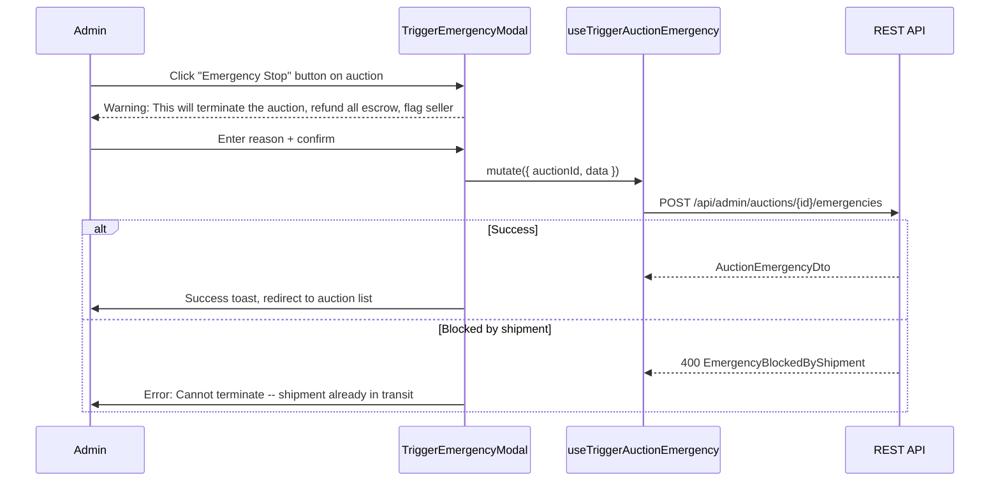

# 08 -- Auction Emergency Actions (Frontend)

> **Status**: Not implemented (service functions and hooks exist, no UI)
> **BE endpoints**: `POST /api/admin/auctions/{id}/emergencies`, `POST /api/admin/auctions/{id}/emergencies/{eId}/resolve`, `POST /api/admin/auctions/{id}/bids/{bidId}/cancel`
> **BE docs**: `backend/docs/flows/12-dispute-moderation/08-auction-emergency.md`
> **FE service**: `adminService.triggerAuctionEmergency()`, `adminService.resolveAuctionEmergency()`, `adminService.cancelInvalidBid()`
> **FE hooks**: `useAdmin.useTriggerAuctionEmergency()`, `useAdmin.useResolveAuctionEmergency()`, `useAdmin.useCancelInvalidBid()`

## Overview

Auction emergency actions allow admins to immediately terminate an auction (e.g., due to fraud, collusion, or policy violation), resolve existing emergencies, and cancel invalid bids. These are high-severity admin actions with significant side effects: auction termination, escrow refunds, deposit returns, seller risk flagging, and optional auto-suspension. The FE has all service functions and hooks ready but no UI to trigger them.

Note: The escalate-from-report path (`POST /api/admin/reports/{id}/escalate-emergency`) also triggers auction emergencies. That flow is documented in [02-admin-report-management.md](./02-admin-report-management.md) and is already implemented in `AdminReportsPage`.

## Existing FE Code

### Service Functions

**File**: `src/services/adminService.ts`

```typescript
// Trigger a new emergency on an auction
export async function triggerAuctionEmergency(
  auctionId: string,
  data: TriggerAuctionEmergencyRequest
): Promise<void> {
  await api.post(`/api/admin/auctions/${auctionId}/emergencies`, data);
}

// Resolve an existing emergency
export async function resolveAuctionEmergency(
  auctionId: string,
  emergencyId: string,
  data: ResolveAuctionEmergencyRequest
): Promise<void> {
  await api.post(`/api/admin/auctions/${auctionId}/emergencies/${emergencyId}/resolve`, data);
}

// Cancel an invalid bid
export async function cancelInvalidBid(
  auctionId: string,
  bidId: string,
  data: CancelInvalidBidRequest
): Promise<BidDto> {
  const response = await api.post<BidDto>(
    `/api/admin/auctions/${auctionId}/bids/${bidId}/cancel`, data
  );
  return response.data;
}
```

### Request Types

```typescript
interface TriggerAuctionEmergencyRequest {
  triggerSource?: string | null;   // e.g. "admin_action", "report_escalation"
  reason?: string | null;         // Why the emergency is triggered
  payload?: unknown;              // Additional context data
}

interface ResolveAuctionEmergencyRequest {
  status?: string | null;         // Resolution status
  payload?: unknown;              // Resolution context
}

interface CancelInvalidBidRequest {
  reason?: string | null;         // Why the bid is being cancelled
}
```

### Hooks

**File**: `src/hooks/useAdmin.ts`

```typescript
export function useTriggerAuctionEmergency() {
  return useMutation({
    mutationFn: ({ auctionId, data }) => triggerAuctionEmergency(auctionId, data),
  });
}

export function useResolveAuctionEmergency() {
  return useMutation({
    mutationFn: ({ auctionId, emergencyId, data }) =>
      resolveAuctionEmergency(auctionId, emergencyId, data),
  });
}

export function useCancelInvalidBid() {
  return useMutation({
    mutationFn: ({ auctionId, bidId, data }) => cancelInvalidBid(auctionId, bidId, data),
  });
}
```

Note: None of these hooks have cache invalidation configured. When the UI is built, they should invalidate auction detail, monitoring alerts, and bid list queries.

## BE Endpoint Reference

### POST /api/admin/auctions/{auctionId}/emergencies (Trigger)

**Auth**: `Admin.ManageItems` permission

**What it does** (in order):

1. **Shipment guard**: Checks if order has outbound shipments in `PickedUp`, `InTransit`, `Delivered`, `Returning`, or `Returned` status. If yes, returns `EmergencyBlockedByShipment` error.
2. **Auction termination**: Loads auction with emergencies, item, bids, auto-bids, winner offers. Creates emergency record, terminates auction.
3. **Audit log**: Action `auction_emergency_triggered`.
4. **Order cleanup**:
   - If order is `PendingPayment`: cancels order
   - If order has `Holding` escrows: full refund to buyer via `EscrowSettlementService.RefundBuyerAsync`
   - Cancels any `Pending` or `Booked` outbound shipments
5. **Seller risk flag**: Creates `UserRiskFlag` (type: `auction_emergency`, severity: `High`) for the seller.
6. **Auto-suspend**: If `Ops.AutoSuspendOnEmergency` setting is true and seller is active, suspends the seller account.
7. **Deposit return**: Refunds all held deposits to bidders.

### POST /api/admin/auctions/{auctionId}/emergencies/{emergencyId}/resolve

**Auth**: `Admin.ManageItems` permission

Resolves an existing emergency record with a status and optional payload.

**Audit log**: Action `auction_emergency_resolved`.

### POST /api/admin/auctions/{auctionId}/bids/{bidId}/cancel

**Auth**: `Admin.ManageItems` permission

Cancels a specific bid within an auction.

**Side effects**:
- Creates `MonitoringAlert` (type: `invalid_bid_cancelled`, severity: `High`)
- Audit log: action `invalid_bid_cancelled`

**Response**: `BidDto`

```typescript
interface BidDto {
  id: string;
  auctionId: string;
  bidderId: string;
  amount: number | undefined;
  status: string | null;
  createdAt: string;
}
```

### Error Codes

| Code | HTTP | Condition |
|------|------|-----------|
| `Auction.NotFound` | 404 | Auction does not exist |
| `Auction.EmergencyBlockedByShipment` | 400 | Outbound shipment already in transit/delivered/returning/returned |
| `Report.UnsupportedEmergencyEntity` | 400 | Report's entity type is not "Auction" (escalation path only) |

## FE Implementation Plan

### Where It Would Live

These actions would be added to an **admin auction detail view** or an **admin auction management page**:

1. **Trigger Emergency** -- a danger button on the auction detail page (admin view), requiring confirmation
2. **Cancel Invalid Bid** -- an action button on individual bids in the bid history table (admin view)
3. **Resolve Emergency** -- visible on auctions that have an active emergency

### Proposed Components

| Component | Purpose |
|-----------|---------|
| `TriggerEmergencyModal` | Confirmation modal with reason textarea and payload field. Explains consequences (auction termination, refunds, seller flag/suspension). |
| `CancelBidButton` | Action button on bid rows in admin bid history. Opens confirmation modal with reason input. |
| `ResolveEmergencyModal` | Modal shown on auctions with active emergencies to mark resolution. |

### Proposed Flow -- Trigger Emergency



### Proposed Flow -- Cancel Invalid Bid

1. Admin views bid history on an auction detail page
2. Clicks "Cancel" action on a suspicious bid
3. Confirmation modal appears with reason input
4. Submits -- calls `cancelInvalidBid()`
5. Bid status updated, monitoring alert created automatically by BE

### Cache Invalidation (To Add)

When implemented, hooks should be updated to invalidate:
- `['auction', auctionId]` -- auction detail
- `['auctionBids', auctionId]` -- bid history (for cancel bid)
- `['admin', 'monitoring-alerts']` -- new alerts created by BE side effects
- `['admin', 'users', sellerId]` -- seller detail (risk flag + possible suspension)
